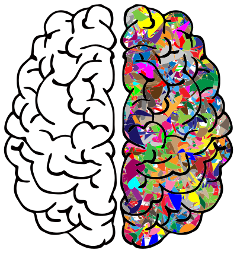
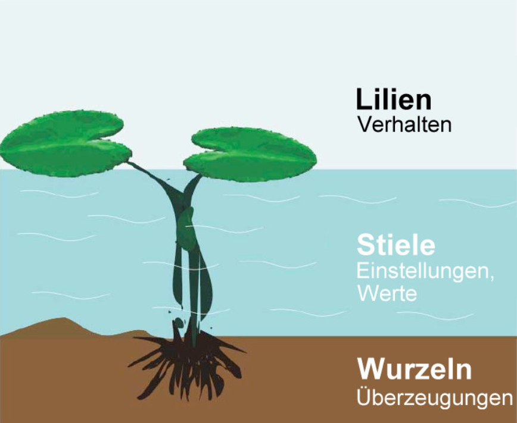
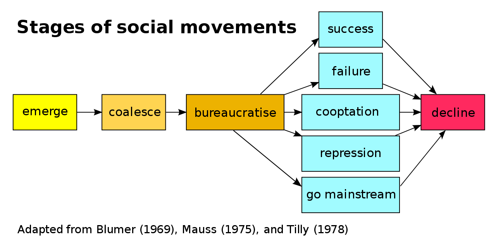
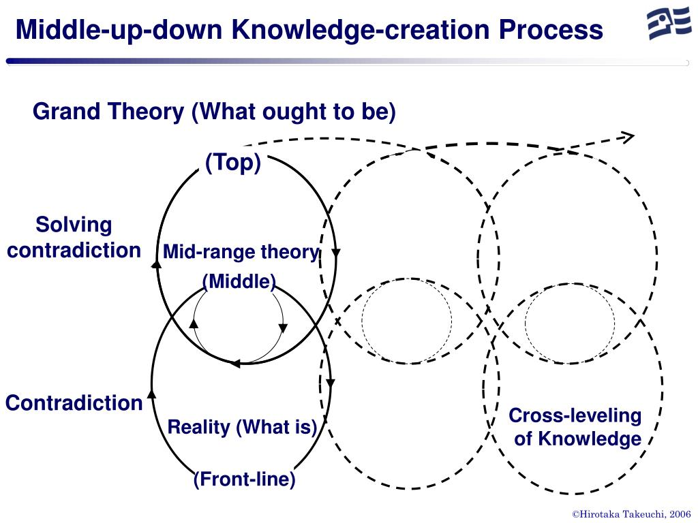
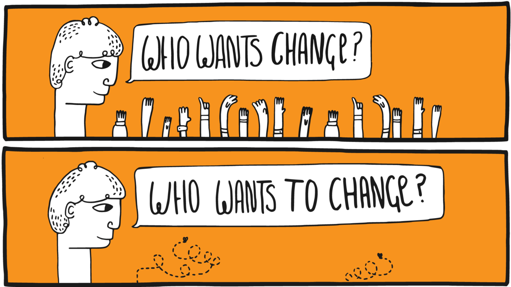
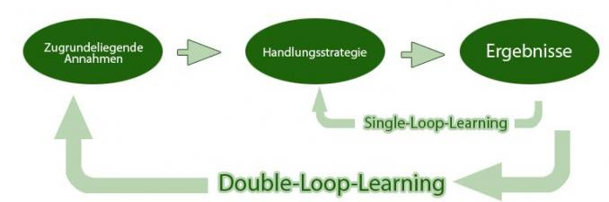
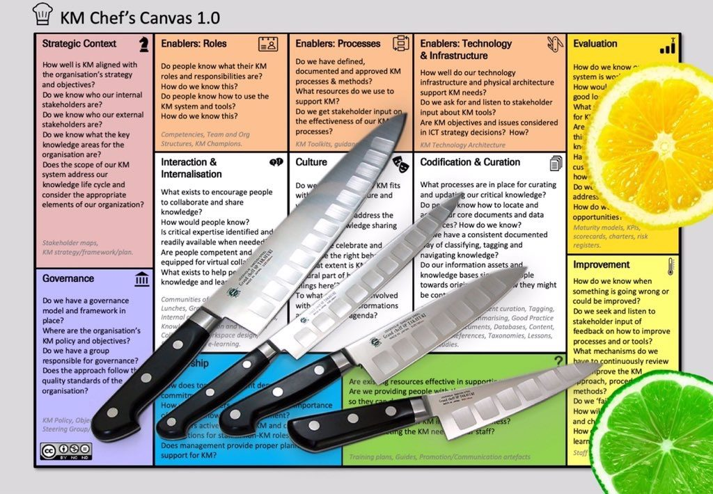
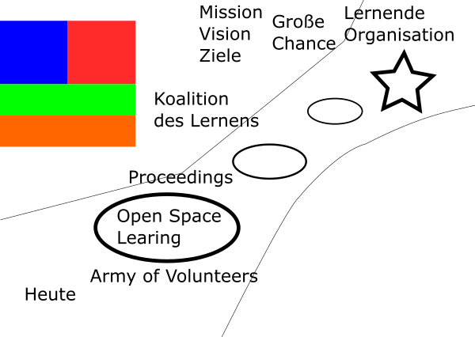

# Grundlagen

## Ein zeitgemäßes Verständnis von Organisationen

[Organisationen](https://de.wikipedia.org/wiki/Organisation) als Teil der Gesellschaft gibt es in vielen Formen und Größen, z.B. Unternehmen, Schulen, Vereine und Parteien. Man weiß intuitiv, wann man es mit einer Organisation zu tun hat. Den Begriff Organisation zu definieren, ist aber nicht ganz so leicht. Der folgende Ausflug in die Organisationstheorie soll ein gemeinsames Verständnis des Organisationsbegriffs ermöglichen.

### Zweck, Mitgliedschaft und Hierarchie

Für die Entwicklung Lernender Organisationen ist ein Grundverständnis von [Organisationstheorie](https://de.wikipedia.org/wiki/Organisationstheorie) und [Systemtheorie](https://de.wikipedia.org/wiki/Systemtheorie), insbesondere [komplexe adaptive System](https://de.wikipedia.org/wiki/Komplexes_adaptives_System) und [soziotechnische Systeme](https://de.wikipedia.org/wiki/Soziotechnisches_System), notwendig. Ein System besteht aus Einzelteilen und ist von seiner Umwelt abgegrenzt. Ein Unternehmen wäre danach z.B. von der Gesellschaft (Umwelt) abgegrenzt, gleichzeitig besteht es aus Abteilungen, Menschen und Prozessen (Einzelteile).

Der Soziologe Niklas Luhmann ist eine Organisation durch drei Merkmale gekennzeichnet (s.a. Kühl, S.: [Organisationen - eine sehr kurze Einführung](https://amzn.to/3jCIVtW)):

1. **Zweck:** der selbst gegebene Zweck der Organisation dient als roter Faden für alles organisatorische Handeln.
2. **Mitgliedschaft:** die Organisation kann über den Ein- und Austritt von Mitglieder entscheiden.
3. **Hierarchien:** durch die Gliederung des Zwecks der Organisation in Unterzwecke und die Übertragung von Verantwortung für Unterzwecke entstehen hierarchische Verantwortungsstrukturen. 

[Stefan Kühl](https://www.linkedin.com/in/stefan-k%C3%BChl-7875213/) unterscheidet mit "Maschine", "Spiel" und "Fassade" drei Seiten der Organisation. Die Fassade beschreibt die Schauseite der Organisation in Richtung ihrer Umwelt ("Wir sind die Besten"). Der Begriff Maschine beschreibt das berechenbare Verhalten einer Organisation eine Leistung zu erbringen (Effizienz und Effektivität). Mit Spiel ist die Lebendigkeit der Organisation auch abseits des offiziellen Regelwerks gemeint (Informale Organisation).

### 2 Betriebssysteme, 1 Organisation

Die Ursprünge der Organisationtheorie liegen in der Organisation von bürokratischen und militärischen Systemen (z.B. [Max Weber](https://de.wikipedia.org/wiki/Max_Weber), [Henri Fayol](https://de.wikipedia.org/wiki/Henri_Fayol), [Frederick W. Taylor](https://de.wikipedia.org/wiki/Frederick_Winslow_Taylor), [Sunzi](https://de.wikipedia.org/wiki/Sunzi)). [Bürokratische Strukturen](https://de.wikipedia.org/wiki/B%C3%BCrokratie) mit einfachen [Hierarchien](https://de.wikipedia.org/wiki/Hierarchie) funktionieren gut, solange die Umwelt einer Organisation stabil ist und sich nur langsam wandelt. Im 21. Jahrhundert haben jedoch viele Organisationen Schwierigkeiten, mit der zunehmenden Geschwindigkeit des Wandels mitzuhalten oder gar den Wandel positiv zu gestalten (s.a. Kotter., J.: Accelerate: strategischen Herausforderungen schnell, agil und kreativ begegnen).

Das Problem erklärt [John Kotter](https://www.linkedin.com/in/johnkotter/) sehr anschaulich im Video [Accelerate! The Evolution of the 21st Century Organization](https://www.youtube.com/watch?v=Pc7EVXnF2aI). Die formale Organisation ermöglicht Stabilität und vorhersehbares Verhalten der Organisation. Um auf Wandel schnell reagieren zu können braucht es neben der Hierarchie aber auch eine Netzwerk-Struktur, die dynamisch und flexibel reagieren kann. Hierbei geht es nicht um eine Entweder-Oder-Entscheidung. Eine Organisation muss die für sie richtige Balance zwischen Stabilität und Agilität finden. Der Stabilität-Agilität-Schieberegler muss für unterschiedliche Teile der Organisation i.d.R. unterschiedlich eingestellt werden (z.B. in der Produktion mehr Stabilität, in der Entwicklung mehr Agilität).

Die notwendige Organisationsstruktur nennt Kotter duales Betriebssystem (Dual Operating System). Das duale Betriebssystem besteht aus Hierarchie auf der einen und Netzwerk auf der anderen Seite. Das Netzwerk besteht aus einer sog. Führungskoalition (Guiding Coalition) als Sonne im Zentrum und strategischen Initiativen (Planeten) und Subinitiativen (Monde) außen herum. Die Netzwerk-Struktur ist dynamischer, als die Hierarchie. Initiativen können jederzeit gestartet, gestoppt, kombiniert oder geteilt werden.

](images/dual-operating-system.gif)

Der Führungskoalition als Kern der Netzwerkstruktur kommt im dualen Betriebssystem eine besondere Bedeutung zu. Sie besteht aus Mitarbeitenden aus allen Bereichen der Organisation, die ein starkes Dringlichkeitsgefühl für die Veränderung der Organisation haben und eine Führungsrolle (nicht notwendigerweise hierarchische Führung) im Wandel übernehmen wollen. Das Kernteam besitzt die notwendige Motivation, das Engagement, das Netzwerk, die Fähigkeiten und die Informationen, um seiner Rolle als Kern der Netzwerkstruktur gerecht zu werden.

Kotter benennt folgende 5 Prinzipien für ein gut funktionierendes duales Betriebssystem:

1.  Wichtige Veränderungen werden von vielen Mitarbeitenden aus allen Bereichen vorangetrieben und nicht nur von den üblichen Auserwählten
2. Es herrscht eine Haltung des Wollens und nicht des Müssens
3. Der Antrieb kommt aus dem Herzen und dem Kopf, nicht nur aus dem Kopf
4. Es findet viel mehr Führung statt und nicht nur mehr Management
5. Es gibt eine untrennbare Partnerschaft von Hierarchie und Netzwerk, nicht nur eine optimierte Hierarchie

Die Notwendigkeit der dualen Betrachtung zeitgemäßer Organisationsformen wird neben Kotter noch in vielen weiteren Quellen aufgegriffen. Im Folgenden eine kleine Auswahl von Beispielen:

* Agilität und Stabilität in [Agility: It rhymes with stability](https://www.mckinsey.com/business-functions/organization/our-insights/agility-it-rhymes-with-stability) von McKinsey.
* Dynamikrobuste Organisationen mit blauer und roter Seite in [Abbildungen und Erläuterungen
  zu den Denkwerkzeugen dynamikrobuster Höchstleister](http://dynamikrobust.com/wp-content/uploads/2016/03/Denkzettel-1-29-komplett.pdf) von Gerhard Wohland.
* Organisationale Ambidextrie mit Exploitation (Ausbeuten & Effizienz) und Exploration (Lernen & Innovation) in [Organizational Ambidexterity: Past, Present and Future](https://www.hbs.edu/faculty/Publication%20Files/O%27Reilly%20and%20Tushman%20AMP%20Ms%20051413_c66b0c53-5fcd-46d5-aa16-943eab6aa4a1.pdf).
* Management 2.0 in [The Future of Management](https://amzn.to/3glWhsA) von Gary Hamel.

### Von der Maschine zu Gehirn und Organismus als Metapher

Um die Wichtigkeit der lebendigen, dynamischen, kreativen und menschlichen Seite der Organisation zu betonen, bietet sich ein Wechsel der Metapher an, mit der über die Organisation gesprochen wird. Oftmals wird von Organisationen wie von Maschinen gesprochen, die produktiv funktionieren sollen und in denen die Menschen nur ein Zahnrädchen darstellen, das bei Defekt einfach ausgetauscht werden kann (schön dargestellt im Film [Moderne Zeiten](https://www.youtube.com/watch?v=HAPilyrEzC4) mit Charlie Chaplin).

Mit dem Übergang von [Industriegesellschaft](https://de.wikipedia.org/wiki/Industriegesellschaft) zu [Wissensgesellschaft](https://de.wikipedia.org/wiki/Wissensgesellschaft) wurden die Wissensarbeiter ([Knowledge Worker](https://en.wikipedia.org/wiki/Knowledge_worker)) zum zentrallen Wertschöpfungsfaktor von Organisationen, Maschinen und Computer dagegen leicht austauschbar. Die Herausforderungen, die sich daraus für die Führung und Gestaltung von Organisationen im 21. Jahrhundert ergeben, fasst Peter Drucker in diesem Zitat anschaulich zusammen:

> The most important, and indeed the truly unique, contribution of  management in the 20th century was the fifty-fold increase in the  productivity of the MANUAL WORKER in manufacturing. The most important  contribution management needs to make in the 21st century is similarly  to increase the productivity of KNOWLEDGE WORK and the KNOWLEDGE WORKER.

Um dieser notwendigen "Re-Humanisierung" der Organisations- und Arbeitswelt gerecht zu werden sollte in der Sprache eher das Gehirn oder ein Organismus denn die Maschine oder der Roboter als Metapher verwendet werden. 

### Organisationskultur

Neben der Struktur der Organisation gewinnt auch die organisationale Kultur für den Erfolg der Organisation immer mehr an Bedeutung. Der Begriff Kultur wir hierbei aber sehr unterschiedlich verwendet ("Wie wir hier arbeiten", "Unsere Werte", "Mentalität und Mindset" etc.).

Der Sozialwissenschaftler [Edgar Schein](https://de.wikipedia.org/wiki/Edgar_Schein) hat mit seinem [Kultureben-Modell](https://de.wikipedia.org/wiki/Kulturebenen-Modell) eine gute Darstellung für die verschiedenen Ansatzpunkte für den Kulturwandel in Organisationen geschaffen. Das Modell besteht aus drei Ebenen, die sich wechselseitig beeinflussen (Schein, E.: [Organisationskultur](https://amzn.to/2D4fosE)):

* **Artefakte:** sichtbare Organisationsstrukturen und -prozesse
* **Öffentlich probagierte Werte:** Strategien, Ziele Philosophien
* **Grundlegende unausgesprochene Annahmen:** unbewusst, für selbstverständlich gehaltene Überzeugungen, Wahrnehmungen, Gedanken und Gefühle

Schein weist aber auch darauf hin, das die drei Ebenen "Manifestationen von Kultur", nicht die Kultur selber sind. Aus dem Modell ergeben sich für einen kulturellen Wandel die Ansatzpunkte Veränderung von Artefakten, probagieren neuer Werte sowie das Hinterfragen von Grundannahmen.

Die drei Ebenen können aufgrund der Merkmale Sichtbarkeit und einfacher Möglichkeiten der Veränderung auch als Wasserlilie mit den Blättern (sichtbar, oberhalb des Wasserspiegels), dem Stängel (verschwommen, im Wasser) und den Wurzeln (unsichtbar, im Boden) dargestellt werden:

## Veränderung von Organisationen

Organisationen leben nicht unendlich. Die durchschnittliche Lebenserwartung eines US-amerikanischen Unternehmens beispielsweise liegt aktuell bei rund 10 Jahren (s.a. Studie [The Mortality of Companies](https://royalsocietypublishing.org/doi/10.1098/rsif.2015.0120)). In ihrer Lebenszeit durchläuft eine Organisation viele Veränderungsprozesse, die einen von zwei Ausgangspunkte haben kann:

1. **Änderungen in der Umwelt (reaktiv):** Entwicklungen wie Digitalisierung, Globalisierung und der technologische Fortschritt führen dazu, dass sich Organisationen an geänderte Rahmenbedingungen anpassen müssen, um effektiv zu sein oder im Wettbewerb bestehen zu können.
2. **Motivation der Organisation (proaktiv):** im Rahmen ihrer Entwicklung verfolgen Organisationen neue Ziele oder sehen sich mit Problemen konfrontiert, die einen Wunsch zur Veränderung aufkommen lassen (z.B. digitale Transformation, agile Transformation).

Den systematischen Umgang mit Veränderungen nennt man Veränderungs- oder Change Management. Handelt es sich bei der Veränderung um einen fundamentalen und dauerhaften Wandel, spricht man oft auch von Revolution (Industrielle Revolution) oder Transformation (Digitale Transformation, Agile Transformation).

**ProTip:** Starte immer mit dem Warum (s.a. Sinek, S.: [Start With Why](https://amzn.to/2WRLEWK), Video [Wie große Führungspersönlichkeiten zum Handeln inspirieren](https://www.youtube.com/watch?v=qp0HIF3SfI4)): damit du beim Start einer Initiative zur Entwicklung der Organisation ein klares Ziel vor Augen hast und keinen kurzfristigen Moden hinterherläufst ist es wichtig, sich den Grund genau zu überlegen. Gibt es einen guten Grund die Organisation zu verändern? Kommt der Grund eher von außen (z.B. [Megatrends](https://de.wikipedia.org/wiki/Trend_(Soziologie)#Megatrend), [Kondratjew-Zyklen](https://de.wikipedia.org/wiki/Kondratjew-Zyklus) oder [gesellschaftlichem Wandel](https://de.wikipedia.org/wiki/Sozialer_Wandel))? Oder gibt es einen intern Grund, sich verändern zu wollen (z.B. Digitale Transformation, Agile Transformation)?

### Gleicher's Formel für Veränderung

David Gleicher hat sich schon in den 1960er Jahren mit der Frage beschäftigt, wann in Organisationen überhaupt Veränderung geschieht bzw. wie groß die Erfolgsaussichten von Veränderungsinitiativen sind. Das Ergebnis hat er in der Formel für Veränderung (s.a. [Formula for Change](https://en.wikipedia.org/wiki/Formula_for_change#cite_note-3)) zusammengefasst:

**C = D x V x F > R**

Veränderung (Change) geschieht dann, wenn das Produkt aus der Unzufriedenheit mit der aktuellen Situation (Dissatisfaction), der Vision einer positiven Zukunft (Vision) und konkrete erste Schritte in Richtung Vision (First Steps) größer ist, als der Widerstand gegen die Veränderung (Resistance). Da der Kern der Gleichung ein Produkt ist, führt jeder Faktor mit Wert 0 (z.B. Visionslosigkeit, völlige Zufriedenheit mit der Situation) zum Stillstand in der Organisation.

**ProTip:** die Veränderungsformel kann man in Workshops gut dafür verwenden, um in einer Spalte unter jedem Buchstaben konkrete Aussagen zu sammeln und zu bewerten (z.B. "Womit sind wir unzufrieden?", "Wo wollen wir in?", "Welche konkreten Schritte können wir uns vorstellen?", "Mit welchen Widerständen müssen wir rechen?").

### Veränderung Top-down

Beim der Wandel einer Organisation denken viele intuitiv an den Anstoß der Veränderung aus der obersten Leitung, die Definition von Ist- und Soll-Zustand und dem Einsatz sog. [Change Agents](https://de.wikipedia.org/wiki/Change_Agent) zur Begleitung der Veränderung. Die Veränderung ist i.d.R. innerhalb von Monaten oder Jahren abgeschlossen. Viele Veränderungsmaßnahmen, wie beispielsweise eine organisatorische Veränderung oder die Einführung von Software, lassen sich mit so einem Ansatz bewerkstelligen.

Der wohl bekannteste Top-down Change-Management-Ansatz **8-Stufen-Prozess** zur Führung von Veränderungsprozessen (Kotter, J.: Leading Change). Im Jahr 2014 hat John Kotter seinen Veränderungsprozess an die neuen Rahmenbedingungen des 21. Jahrhunderts mit einer erhöhten Veränderungsgeschwindigkeit angepasst (s.a. Kotter, J.: [Accelerate!](https://hbr.org/2012/11/accelerate)). Der neue Ansatz besteht jetzt aus fünf Prinzipien und acht "Beschleunigern":

**Die 5 Prinzipien des Dual Operating System:**

1. Viele Change Agents, nicht nur die üblichen wenigen Ernannten.
2. Ein Mindset des Wollens und nicht des Müssens.
3. Kopf und Herz, nicht nur Kopf.
4. Viel mehr Führung, nicht nur mehr Management.
5. Zwei Systeme, eine Organisation.

**Die 8 Schritte bzw. Beschleuniger der Veränderung im Vergleich:**

|      | Schritt der Veränderung (1996)                           | Beschleuniger der Veränderung (2014)                         |
| ---- | -------------------------------------------------------- | ------------------------------------------------------------ |
| 1    | Ein Gefühl der Dringlichkeit erzeugen                    | Ein Gefühl der Dringlichkeit rund um eine große Chance erzeugen |
| 2    | Eine Führungskoalition (en: Guiding Coalition) aufbauen  | Eine Führungskoalition (en: Guiding Coalition) aufbauen und dauerhaft unterstützen |
| 3    | Vision und Strategie entwickeln                          | Eine strategische Vision und Veränderungsinitiativen rund um die große Chance entwickeln |
| 4    | Die Vision des Wandels kommunizieren                     | Vision und die Strategie kommunizieren, um Buy-in zu erzeugen und eine wachsende Gruppe Freiwilliger (en: army of volunteers) zu aktivieren |
| 5    | Mitarbeiter zu breit angelegten Aktionen befähigen       | Die Bewegung hin zur Vision und zur großen Chance beschleunigen, indem Sie dafür sorgen, dass das Netzwerk Barrieren beseitigt |
| 6    | Kurzfristige Erfolge erzielen                            | Sichtbare, bedeutende kurzfristige Siege feiern              |
| 7    | Fortschritte konsolidieren und mehr Veränderung bewirken | Niemals aufgeben. Lernen Sie weiter aus Erfahrungen. Erklären Sie den Sieg nicht zu früh |
| 8    | Neue Ansätze in der Kultur verankern                     | Strategische Veränderungen in der Kultur institutionalisieren |

### Veränderung Bottom-up

Neben der Veränderung vom oberen Ende der Hierarchie kann der Impuls zur Veränderung auch von unten kommen. In der Gesellschaft spricht man dabei von [sozialen Bewegungen](https://de.wikipedia.org/wiki/Soziale_Bewegung) (z.B. Occupy Wallstreet, Fridays for Future), in Organisationen wird oft der Begriff der Graswurzelbewegung verwendet (z.B. [#gernperDu](http://www.gernperdu.de), [Working Out Loud](https://workingoutloud.com/de/fur-dich)). Gemein ist diesen Bewegungen, dass sie aus einer Gruppe von Personen besteht, die mit verschiedenen Mobilisierungs- und Handlungsstrategien versucht, gesellschaftlichen oder organisatorischen Wandel zu beschleunigen, zu verhindern oder umzukehren. Nach Herbert Blumer (1969) durchläuft eine soziale Bewegung einen fünfstufigen Lebenszyklus:

Eine Übersicht aktueller Graswurzelbewegungen in Organisationen sind im Buch [Graswurzelinitiativen in Unternehmen: Ohne Auftrag – mit Erfolg!](https://amzn.to/39SjqQX) von Sabine und Alexander Kluge zusammengefasst (s.a. Podcast [Kluges aus der Mitte](https://klugesausdermitte.podigee.io)).

### Veränderung Middle-Up-Down

Die Notwendigkeit, sich als Organisation immer schneller zu verändern, erfordert neue Ansätze. Top-Down-Ansätze erzeugen oft nicht die notwendige Veränderungsbereitschaft in der Breite, Bottom-Up-Ansätze stoßen an die sprichwörtliche "gläserne Decke" und sie verlaufen im Sand. In ihrem Buch The Knowledge-Creating Company haben Ikujiro Nonaka und Hirotaka Takeuchi den Ansatz des Middle-Up-Down Managements beschrieben, der schnelle Informationsverteilung und Wissensgenerierung in einer Organisation ermöglicht.

Anders als die oft zitierte "Lähmschicht mittleres Management" sehen sie gerade Fach- und Führungskräften auf den mittleren Ebenen als entscheidende Akteure im Veränderungsprozess. Sie können die Brücke zwischen den visionären Idealen der obersten Leitung und den oft chaotischen Realitäten der Mitarbeitenden an vorderster Front bilden. Es entsteht eine spiralartige Bewegung, in der die großen Vision immer wieder an den bestehenden Realitäten gespiegelt werden und iterativer Fortschritt entsteht.

### Lead by example - Mit gutem Beispiel vorangehen

Im Veränderungsmanagement gibt es den schönen Spruch "Leading by example is not only a change method but the only one". Gerade, wenn es bei dem Veränderungsvorhaben um Werte- oder Verhaltensänderung geht, müssen alle Treiber des Wandels mit gutem Beispiel voran gehen (Vorbilder, Role Models). Diesen Ansatz der Veränderung hat Mahatma Ghandi in diesem kurzen Zitat gut auf den Punkt gebracht:

> Be the change you want to see in the world.

Das Video [First Follower: Leadership Lessons from Dancing Guy](https://www.youtube.com/watch?v=fW8amMCVAJQ) zeigt das Gefühl, das man als erster Treiber einer Veränderung hat: man fühlt sich als "Lone Nut". Es kommt darauf an, die ersten Personen zu finden, die mitmachen (First Follower). Sind diese gefunden, ist der Kern für für eine Veränderungsbewegung geschaffen, die von alleine wachsen und skalieren kann. Das Gefühl, das sich einstellt hat Lugano Kihachi im [Video zum Continental GUIDE Kick-off](https://www.youtube.com/watch?v=Pm-np_XNqMc) mit "I'm not alone!" schön in Worte gekleidet.

## Die Lernende Organisation und ihre Feinde

Die Veränderung der Organisation ist immer mit Lernen auf individueller und/oder organisationaler Ebene verbunden. Die Idee der Lernenden Organisation geht zurück in die 1990er Jahre und die Gründung des MIT Center for Organizational Learning mit [Peter Senge](https://de.wikipedia.org/wiki/Peter_M._Senge) als als Direktor sowie [Edgar Schein](https://de.wikipedia.org/wiki/Edgar_Schein) und [Chris Argyris](https://de.wikipedia.org/wiki/Chris_Argyris) als Schlüsselpersonen. Ähnlich wie das Konzept des [Wissensmanagements](https://de.wikipedia.org/wiki/Wissensmanagement) betont das organisationale Lernen die Bedeutung von Lernen und Wissen für den Erfolg von Organisationen.

Eine Lernende Organisation unterscheidet sich von einer Nicht-Lernenden Organisation dadurch, dass sie Wissen und Lernen nutzt, um sich mit der notwendigen Veränderungsgeschwindigkeit and die Veränderung in der Umwelt anzupassen ([Survival of the Fittest](https://de.wikipedia.org/wiki/Survival_of_the_Fittest)):

> Eine **Lernende Organisation** ist eine Organisation, die in der Lage ist, Wissen zu schaffen, zu erwerben, zu interpretieren, zu übertragen und zu bewahren und ihr Verhalten gezielt zu ändern, um neues Wissen und neue Einsichten zu reflektieren (David Garvin).

Da Wissen nie final ist, geht es bei der Lernenden Organisation nicht um idealen Zustand mit finalem Wissen. Wie dieser Witz verdeutlicht, geht es vielmehr darum, die sprichwörtliche Nase vorne zu haben:

> Zwei Männer sind zu Fuß in der Wüste unterwegs, als sie plötzlich einem Löwen gegenüberstehen. Der eine Mann reagiert panisch, der andere ist ganz ruhig, greift in seinen Rucksack, holt ein Paar Turnschuhe heraus und beginnt, diese anzuziehen. Sagt der andere Mann zu ihm: “Glaubst Du wirklich, dass Du mit den Turnschuhen schneller laufen kannst, als der Löwe?” Sagt der andere: “Nein, aber schneller, als Du.”.

### Die 2 Schleifen des Lernens

Zu den sehr frühen Modellen des organisationalen Lernens gehört das Zweischleifen-Lernen (Double-Loop-Learning) von Chris Agyris und Donald Schön. Beim Einschleifen-Lernen wird auf eine Differenz zwischen Intention und Ergebnis durch die Wahl einer neuen Handlungsstrategie reagiert. Variablen wie die Normen und Politik der Organisation sowie die Ziele werden als gesetzt hingenommen. Zweischleifen-Lernen der Organisation liegt dann vor, wenn genau diese Veränderung von Variablen für die Lösung von Problemen oder die Erreichung von Ergebnissen auch mit in Betracht gezogen werden.

### Die 5 Disziplinen der Lernenden Organisation

Wohl der bekannteste Ansatz für Lernende Organisationen sind die fünf Disziplinen von Peter Senge (s.a. [Peter Senge and the learning organization](https://infed.org/mobi/peter-senge-and-the-learning-organization/)) aus dem Buch [Die fünfte Disziplin: Kunst und Praxis der Lernenden Organisation](https://amzn.to/30kwStP). Seine Definition einer Lernenden Organisation:

> Learning organizations are organizations where people continually expand their capacity to create the results they truly desire, where new and expansive patterns of thinking are nurtured, where collective aspiration is set free, and where people are continually learning to see the whole together.

Nach Peter Senge unterscheidet sich eine Lernende Organisation von anderen im Beherrschen von fünf Grund-Disziplinen (Prinzipien und Praktiken):

1. **Systemdenken** - in einer komplexen Welt helfen zu einfache Modelle und Frameworks nicht weiter, sie  beleuchten nur die Teile und nicht das Ganze. Der systemische Blickwinkel ist immer langfristig. Er beobachtet auch Verzögerungs- und Rückkopplungsschleifen, die bei kurzfristigen Betrachtungsweisen oft ignoriert werden. Die Erstellung einer "Landkarte des Systems" (system map) kann helfen, die Kernelemente des Systems und ihre Verbindungen wahrzunehmen.
2. **Persönliche Meisterschaft** - ohne individuelles Lernen kann kein organisationales Lernen stattfinden. Personal mastery ist ein lebenslanger Lernmodus, bei dem man nie "ankommt", sondern sich kontinuierlich weiterentwickelt. Das Ziel ist die Reise des Lernens.
3. **Mentale Modelle** - die verinnerlichten Annahmen und Verallgemeinerungen und Bilder, wie wir die Welt sehen und verstehen. Unsere mentalen Modelle beeinflussen unsere Handlungen und wie wir Wissen aufnehmen sehr stark.
4. **Eine gemeinsame Vision entwickeln** - ein geteiltes Bild von der Zukunft, die man gemeinsam erschaffen möchte ist eine sehr starke Motivation für Experimente und Innovation. Menschen lernen und übertreffen sich, weil sie wollen, nicht weil sie müssen.
5. **Lernen im Team** - das Lernen im Team startet mit dem Dialog und dem "gemeinsamen Denken". Dialog zusammen mit dem Systemdenken fördert eine Sprache, die dem Umgang mit steigender Komplexität angemessen ist.

Senge weist zusätzlich darauf hin, dass eine Lernende Organisation einer neuen Sicht auf Führung bedarf:

> In a learning organization, leaders are designers, stewards and teachers. They are responsible for building organizations were people continually expand their capabilities to understand complexity, clarify vision, and improve shared mental models – that is they are responsible for learning…. Learning organizations will remain a ‘good idea’… until people take a stand for building such organizations. Taking this stand is the first leadership act, the start of inspiring (literally ‘to breathe life into’) the vision of the learning organization.

### Die 3 Bausteine der Lernenden Organisation

Nach der Einschätzung David Garvin und Amy Edmondson (s.a. [Is Your's a Learning Organization?](https://hbr.org/2008/03/is-yours-a-learning-organization)) sind die fünf Disziplinen von Senge nicht konkret genug, um Handlung in Organisationen zu erzeugen ("They overemphasized the forest and paid little attention to the trees"). Aus der Forschung zu Organisation über zwei Jahrzehnte haben sie drei Bausteine (Building Blocks) für die Entwicklung einer Lernenden Organisation identifiziert:

1. **Führung, die das Lernen stärkt** - das Lernen in einer Organisation wir sehr stark vom Verhalten der Führungskräfte beeinflusst. Wenn diese aktiv fragen, zuhören und dabei den Dialog anregen fühlen sich die Menschen ermutigt zu lernen. Wenn sie darüber hinaus signalisieren, dass ihnen die Investition von Zeit in Problemlösung, Wissenstransfer, Querdenken, neue Ideen und Reflexionsprozesse wichtig ist, werden diese Aktivitäten vermehrt stattfinden.
2. **Konkrete Lernprozesse und -praktiken** - Lernprozesse schließen die Generierung, Sammlung, Interpretation und Verteilung von Informationen sowie das Experimentieren und Testen von neuem Wissen mit ein. Das Gelernte und das Wissen müssen systematisch und auf klar definierten Wegen mit Individuen, Teams oder der ganuen Organisation geteilt werden. Der Wissenstransfer kann sich intern an Organisationsmitglieder richten, aber auch nach extern gerichtet sein (Kunden, Experten, Öffentlichkeit). Reflexionen nach Aktivitäten, Prozessen und Projekten sind oft genanntes Beispiel einer konkreten Lernaktivität (z.B. After Action Review, PDCA-Zyklus)
3. **Eine unterstützende Lernumgebung** - eine lernförderliche Umgebung kennzeichnet sich durch die vier Faktoren psychologische Sicherheit, Wertschätzung von Vielfalt, Offenheit gegenüber neuen Ideen und Zeit für Reflexion. Neben den weichen Faktoren der Lernumgebung gehört zu diesem Baustein auch die physische Lernumgebung (Gebäude, Räume, Lernorte etc.) sowie die virtuelle Lernumgebung (Persönliche Lernumgebung, Intranet, Soziales Netzwerk etc.)

Die drei Bausteine sind dabei unabhängig voneinander. Es können je nach Bedarf in einem oder mehren Handlungsfelder Maßnahmen durchgeführt und Fortschritte gemessen werden.

### Die 13 Feinde der Lernenden Organisation

Spricht man über Wissen und Lernen als Erfolgsfaktoren für die Zukunft gibt es meist keine offensichtliche "Feinde", die aktiv dagegen argumentieren. Wichtig ist daher, sich der vielen kleine und großen Barrieren im Alltag der Entwicklung einer Lernenden Organisation bewusst zu sein, sie frühzeitig in der eigenen Praxis zu erkennen und darauf reagieren zu können.

Der [Europäischer Leitfaden zur erfolgreichen Praxis  im Wissensmanagement](https://www.project-consult.de/Files/CWA_KnowledgeManagement.pdf) (2004) enthält eine recht vollständige Übersicht an Barrieren in der Praxis (inkl. Verweisen auf Kapitel, in denen diese beschrieben sind):

1. **Zeit und Prioritäten:** Das Lernen und Verstehen, die Aneignung und Weitergabe von Wissen benötigen Zeit. In zunehmendem Maße sind Erlaubnis und Erwartungen des Management in Bezug auf das Teilen von Wissen Bestandteil der Stellenbeschreibungen (und Mitarbeiterbeurteilungen).
2. **Unterschied zwischen dem Sagen und dem Tun des Managements:** Eine wissensorientierte Kultur wird nur dann bestehen bleiben, wenn entsprechende Unterstützung gegeben wird. Manager, die Programme einführen und sich dann rapide auf Schwerpunkte in anderen Bereichen stürzen werden jegliche Effizienz und Effektivität, die gutes WM mit sich bringt, verlieren. Ein wesentlicher Hinderungsgrund ist die fehlende Rückendeckung durch das Top-Management.
3. **Die anhaltende Ansicht, dass “Wissen Macht ist”:** Interner Wettbewerb fördert in vielen Organisationen das Horten von Wissen; der alleinige Besitz von Wissen wird als Macht und Jobabsicherung betrachtet.
4. **Gleichgültigkeit in Bezug auf Wissensteilung:** Die Werte und Verhaltensweisen des Topmanagements können die Bereitschaft der Mitarbeiter zum Teilen wesentlich beeinflussen.
5. **Not-invented-here-Syndrom:** Menschen erhalten oft größere Befriedigung durch eigene Erfindungen als durch die Übernahme der Ideen anderer, obwohl dies Zeit oder Geld sparen könnte. Für Organisationen stellen solche “Funktionssilos” oft eine Barriere zur Wissensteilung dar.
6. **Belohnungssysteme die Wissensteilung hemmen:** Manche Belohnungs- und Beurteilungssysteme fördern unabsichtlich das Zurückhalten von Wissen. Sogar wenn sie darauf abzielen, Teilen zu fördern, können sie Kulturveränderungen behindern, daher muss die leistungshemmende Seite von Belohnungssystemen beachtet werden.
7. **Verschiedene Kulturen und Subkulturen:** Es gibt erhebliche Unterschiede zwischen sozialen und nationalen Kulturen, die zu unterschiedlichen Interpretationen und Verhaltensweisen führen können. Schlechtes Management kann Vertrauen und Kommunikation negativ beeinflussen.
8. **Wissen verbreitet sich mit der Sprache:** Ohne eine organisationsweit einheitliche Sprache können Wissen und Erfahrungen nicht kommuniziert werden.
9. **Organisation als Maschine betrachten:** Oft wird die Meinung vertreten, dass eine Organisation wie eine Maschine funktioniert, und dass allein das Ändern einzelner Prozesse ausreicht, um Veränderungen zu bewirken. Organisationen bestehen aber aus Menschen, und diese können nicht lernen, wenn man ihre Lernbedingungen nicht berücksichtigt.
10. **Organisationaler “Gedächtnisverlust”:** Organisationen schaffen es oft nicht, erworbenes Wissen und Lektionen aus der Vergangenheit zu bewahren, insbesondere wenn Experten ausscheiden und deren Wissen nicht dokumentiert wurde.
11. **Anstieg der “virtuellen” Arbeit kann hinderlich wie hilfreich sein:** Obwohl kollaborative Software einem WM-Programm enorme Vorteile bringen kann, gibt es viele Anzeichen dafür, dass Menschen immer noch am besten voneinander von Angesicht zu Angesicht lernen können.
12. **Eine Überbewertung von Technologie oder inadäquate technische Hilfsmittel:** Manche Manager meinen, dass alleine das Bereitstellen von Informationen an Mitarbeiter an sich schon ein Wert für die Organisation darstellt. Der Wert eines Kommunikationskanals liegt nicht so sehr darin, welches Wissen damit verfügbar gemacht wird, sondern in der menschlichen Interaktion, die darüber ermöglicht wird.
13. **Wissen wächst nicht ewig:** Das Verlernen und das Ablassen von alten Denkgewohnheiten, ja sogar das Ausscheiden ganzer Wissensbestände, tragen zur Vitalität und Evolution von Wissen bei.

### Die ISO 30401:2018 als Standard für die Lernende Organisation

Der Standard [ISO 30401:2018](https://www.iso.org/standard/68683.html) wurde vom Technische Kommittee 260 "Human Resource Management" der Internationalen Organisation für Normung (ISO) im Jahr 2018 veröffentlicht. Ziel des Standards ist es, ein für die jeweilige Organisation angepasstes Management System zu entwickeln, dass Wertschöpfung durch Wissen und Lernen systematisch fördert.

Im Standard werden 8 Leitprinzipien für dieses Management System beschrieben, die im folgenden kompakt zusammengefasst sind:

1. Wissen ist immateriell, komplex und wird von Menschen geschaffen
2. Wissen ist die wichtigste Quelle der Wertschöpfung für Organisationen, um ihre Ziele zu erreichen
3. Wissensmanagement dient organisationalen Zielen, Strategien und Bedürfnissen.
4. Es gibt keine One-Size-Fits-All-Lösung. Organisationen müssen ihren eigenen Ansatz entwickeln.
5. Menschen schaffen ihr eigenes Wissen durch das persönliche Verständnis von Informationen und Ereignissen. Gemeinsames Verständnis kann durch Interaktion zwischen Menschen im physischen und virtuellen Raum gefördert werden.
6. Wissen kann man nicht direkt managen. Wissensmanagement fokussiert auf die Schaffung förderlicher Rahmenbedingungen (Arbeitsumgebung), die Einfluss auf den Lebenszyklus des Wissens haben.
7. Die Kultur der Organisation ist ein kritischer Faktor für die Effektivität des Wissensmanagements.
8. Wissensmanagement sollte in Iterationen mit Lern- und Feedbackschleifen organisiert sein.

**Hinweis:** Wissen und Lernen werden im Wissensmanagement als zwei Seiten einer Medaille angesehen: Wissen als Objekt (umgangssprachlich meist Wissen genannt) und Wissen als Prozess (Lernen).

Das [KM Cookbook](https://amzn.to/3iz3Lcz) nutzt die Metapher des Restaurants, um anschaulich Fallbeispiele von Lernenden Organisationen darzustellen. Als Rollen werden dabei der Restaurantbesitzer (Sponsor), die Kunden (Organisation), der Koch (KM Leader) und die Beschäftigten des Restaurants (KM Team und externe Unterstützung) unterschieden. Die Fallbeispiele kommen u.a. von General Electric, der Weltbank, Schlumberger, dem Internationalen Olympischen Kommittee und den Ärzten ohne Grenzen.

Als strategisches Tool wird der KM Chef's Canvas beschrieben, der entlang der Kategorien des ISO 30401 Standards strukturiert ist und 57 Leitfragen stellt, mit denen der eigene Ansatz des Wissensmanagements gestaltet werden kann.

**Hinweis:** Mit dem Durchlaufen des Lernpfades in diesem Leitfaden entwickelt man einen Ansatz der Lernenden Organisation, der alle Anforderungen der ISO 30401:2018 erfüllt.

## Eine Lernende Organisation kultivieren

Dieses Kapitel beschreibt alle notwendigen Bestandteile, um mit lernOS für Organisationen gemeinsam eine Lernende Organisation zu kultivieren. Besonders wichtig ist, von Anfang an auf die richtige Sprache zu achten. So kann man Wissensmanagement, Lernende Organisationen oder Lernkulturen nicht "einführen" Das ist ein in der Vergangenheit oft gemachter Fehler, der meist zum Scheitern oder zumindest nicht zum dauerhaften Überleben des Ansatzes geführt hat. Da man eine Organsation wie ausgeführt als soziotechnisches und komplex-adaptives System begreifen muss, wird hier von der "Kultivierung der Lernenden Organisation" gesprochen. Bei dieser Kultivierung wird neben der Einführung von Methoden und Tools auch die Entwicklung von Rahmenbedingungen, Werten und Haltungen (Mindset) geachtet.

Der Ansatz von lernOS für Organisationen besteht sich aus zwei zentralen Bestandteilen:

1. **Koalition des Lernens:** Die "Guiding Coalition" nach Kotter als zentralem Akteur, bestehend aus einer Gruppe von Personen, die das Leitbild der Lernenden Organisation als "Nordstern" in der Organisation etabliert, unterstützende Initiativen identifiziert und vernetzt sowie. Die Koalition des Lernens kann je nach Geschmack und Bedürfnissen der Organisation natürlich auch anders benannt werden.
2. **Open Space des Lernens:** Das bewährte [Open Space Format](https://de.wikipedia.org/wiki/Open_Space) von Harrison Owen hat Daniel Mezick unter dem Namen [Open Space Agility](https://openspaceagility.com/) für die Entwicklung agiler Organisationen adaptiert. In regelmäßigen Abständen von 3-6 Monaten wird die Organisation eingeladen, sich zu einem ausgewählten Motto auszutauschen und zwischen den Open Spaces Lern-Experimente durchzuführen. Der Open Space des Lernens wird von der Koalition des Lernens organisiert. Auch der Open Space kann bei Bedarf anders benannt werden.

Ähnlich dem Konzept des Lebenslangen Lernens (s.a. lernOS für Dich Leitfaden) kann die Entwicklung oder Kultivierung einer Lernenden Organisation nicht als kurzfristiges Projekt oder Programm angegangen werden, sondern erfordert dauerhaftes Engagement der Organisation.

### Koalition des Lernens (KdL)

Die Koalition des Lernens ist eine Gruppe von mindestens drei Personen in der Organisation, denen Wissen und Lernen wirklich, wirklich am Herzen liegen. Anders als frühere Wissensmanagement-Abteilungen oder Bereiche des Chief Learning/Knowledge Office ist die Koalition des Lernens nicht als "Kästchen im Organigramm" verortet, sondern bildet den Kern der Netzwerkstruktur der Organisation (Wie bei Kotter die "Guiding Coalition"). Akteure in der Koalition des Lernens kommen typischerweise aus Personal, Organisationsentwicklung, IT, Strategie, Wissens-/Innovations-/Qualitätsmanagement oder den Fachbereichen.

](images/dual-operating-system.gif) 

**Eigenschaften der Koalition des Lernens:**

* Besteht aus Menschen aus allen Bereichen und Ebenen der Organisation, die das Gefühl der Dringlichkeit zutiefst verspüren.
* Die Menschen in der Koalition des Lernens wollen Führung übernehmen, Change Agents sein und anderen helfen, das gleiche zu tun.
* Die Kerngruppe der Koalition des Lernens hat den "Drive", das intellektuelle und emotionale Engagement, das Netzwerk, die Fähigkeiten und die Informationen, um eine effektive "Sonne im Sonnensystem des Netzwerks" zu sein.
* Durch das Erlernen der Zusammenarbeit von Koalition des Lernens und des Führungsgremiums der Organisation sind Hierarchie- und Netzwerk-Seite der Organisation strategisch abgestimmt, erreichen ein hohes Niveau von Verlässlichkeit sowie Effizienz und entwickeln eine ganz neue Fähigkeit für Geschwindigkeit und Agilität.

**Die wichtigsten Aufgaben der Koalition des Lernens:**

* Die Vision der Lernenden Organisation als "Nordstern" und die große Chance, die für die Organisation darin liegt klar herausarbeiten, dokumentieren und kommunizieren.
* Einen Sponsor für die Vision der Lernenden Organisation auf oberster Leitungsebene finden und mit diesem im regelmäßigen Austausch sein
* Initiativen identifizieren und sich mit diesen vernetzen, die an der Kultivierung der Lernenden Organisation mitwirken. Bei Bedarf (und verfügbarer Ressource) neue Initiativen starten.
* Eine "Armee von Freiwilligen" auf- und ausbauen, die die Kultivierung der Lernenden Organisation sowie die Initiativen und Lern-Experimente unterstützt.
* Den Open Space des Lernens organisieren und die Lern-Experimente nachverfolgen.
* Kontinuierlich nach neuen Mitgliedern für die Koalition des Lernens Ausschau halten und diese einbinden.
* Erfolge und Geschichten sichtbar machen, kommunizieren und in den Kontext der Lernenden Organisation stellen (nach innen und nach außen).

### Open Space des Lernens (OSdL)

Das Open Space Format (auch Open Space Technology) für Veranstaltungen wurde um 1985 von Harrison Owen entwickelt. Das Format ermöglicht es Gruppen von 5-2.000 Personen in einem (architektonisch und geistig) offenen Raum komplexe Probleme und Fragestellungen zu bearbeiten. Um einen erfolgreichen Open Space durchzuführen braucht es nur vier Dinge:

1. Ein fesselndes Thema oder Motto
2. Eine interessierte und überzeugte Gruppe von Menschen
3. Ort und Zeit für die Veranstaltung
4. Jemanden, der die Führung übernimmt

Ein Open Space hat ähnlich einem BarCamp keine feste Agenda, aber klare Strukturen und Rahmenbedingungen. Der Rahmen ist notwendig, um innerhalb des vorgegebenen Rahmens Selbstorganisation zu ermöglichen. Meist werden 4-5 Prinzipien und ein Gesetz als Rahmenbedingungen verwendet:

* **Prinzip 1:** Wer auch immer kommt, es sind die richtigen Leute
* **Prinzip 2:** Was auch immer geschieht, es ist das Einzige, was geschehen konnte.
* **Prinzip 3:** Es beginnt, wenn die Zeit reif ist.
* **Prinzip 4:** Vorbei ist vorbei - nicht vorbei ist nicht vorbei.
* **Prinzip 5:** Wo auch immer es geschieht, es ist der richtige Ort.
* **Gesetzt:** Die Teilnehmer*innen bleiben nur so lange in einer Gruppe, wie er es für sinnvoll erachtet, also solange er/sie etwas lernt und/oder beitragen kann. Benutze deine beiden Füße, um an einen produktiveren Platz zu gehen.
* **Mache dich darauf gefasst, überrascht zu werden!**

Die Anwendung des Open Space Formats bei Open Space Agility sieht die Wiederholung von Open Spaces im Abstand von 3-6 Monaten vor, um ein verlässliches Raster für Lern-Experimente zu bilden. Für die dauerhafte Begleitung der Open Spaces sind folgende Rollen vorgesehen:

* **Der Sponsor:** authorisiert die Veranstaltung, stellt Wertschätzung der Veranstaltung und ihrer Ergebnisse heraus, übergibt Verantwortung für die Durchführung an den Moderator und lässt dem Open Space seinen Lauf.
* **Der Moderator (en: facilitator):** erhält die Verantwortung für die Durchführung vom Sponsor, ermöglicht die Selbstorganisation im Open Space und übergibt die Verantwortung für den Erfolg der Veranstaltung an die Teilnehmer.
* **Die Teilnehmer:** entscheiden Session-Besuche und Diskussions-Teilnahmen selbstorganisiert, teilen die Ergebnisse mit dem Rest der Organisation 
* **Die Session-Geber:** schlagen Sessions und Themen für kleine Gruppen vor, ermöglichen allen Session-Teilnehmern Beiträge und sind für die Dokumentation der Session verantwortlich.

Bei Open Space Agility führen Teams in der Organisation zwischen den Open Spaces Experimente mit agilen Methoden unterstützt durch Coaches durch. Beim Open Space des Learnings geht es nicht (nur) um Agilität. Die Leitplanken bildet die Lernende Organisation als Nordstern. Welches Thema oder Motto in einem Open Space behandelt werden soll und welche Initiativen gezielt eingeladen werden sollen, legt die Koaliton des Lernens in Abstimmung mit dem Sponsor fest.

Zentraler Erfolgsfaktor des Open Space Formats ist der einladungsbasierte Ansatz und damit die Freiwilligkeit der Teilnahme: alle Mitglieder der Organisation sind eingeladen, die die kommen, sind genau die richtigen (s.a. Mezick, D.: [Inviting Leadership: Invitation-Based Change in the New World of Work](https://amzn.to/3fQRGgS)). Darüber wird langfristig ein großes Netzwerk von Freiwilligen ("Army of Volunteers") aufgebaut, die aus eigenem Antrieb bei der Kultivierung der Lernenden Organisation mitwirken.

Aus Identitätsgründen sollte sich so ein Netzwerk von Freiwilligen einen geeigneten Namen geben. Oft bestehen bereits aus anderen Projekten, Programmen und Initiativen derartige Netzwerke, die ein guter Ausgangspunkt für den Aufbau sein können. Beispiele für solche Netzwerke aus der Praxis:

* GUIDE Netzwerk bei Continental
* Zusammenarbeit 2.0 Guides bei Audi
* DigitalTogether Champions bei Siemens Healthineers
* Community of Practice Change & Transition (CoPCaT) bei DATEV
* Change Agent Teams (CATs) bei Bayer
* Digital Collaboration Multiplier Network bei Schaeffler
* DieGuides für's #AndersArbeiten bei Deutsche Telekom
* Group Collaboration Guides bei Volkswagen
* Grains bei Siemens
* uvm.

Eine typischer Ablauf eines 1-tägigen Open Space kann z.B. so aussehen (im Gegensatz zu BarCamps mit 45-minütigen Sessions dauert eine Open Space Session in der Regel 90 Minuten):

| Zeit            | Agendapunkt                               |
| --------------- | ----------------------------------------- |
| 09:00-10:30 Uhr | Eröffnung und Erstellung der Agenda       |
| 10:30-12:00 Uhr | Session 1                                 |
| 12:00-13:00 Uhr | Mittagspause                              |
| 13:00-14:30 Uhr | Session 2                                 |
| 14:30-16:00 Uhr | Session 3                                 |
| 16:00-16:30 Uhr | Dokumentation (Erstellung des Protokolls) |
| 16:30-17:00 Uhr | Abschluss                                 |

Der Raum für den Open Space muss genug Platz für alle Teilnehmenden bieten (für Eröffnung, Abschluss und kleine Sessions). Daneben muss es genug Breakout-Räume geben, in die sich die Sessions zurückziehen können (Daumenregel: Teilnehmerzahl/20). In dem Raum muss es eine Wand geben, an die die Agenda und der Sessionplan (auch Space/Time Matrix genannt) mit Haftnotizen und Flipchart-Papier geklebt werden kann. Bei 100 Teilnehmenden kann das z.B. so aussehen:

| Zeit        | Plenum        | Raum 1      | Raum 2      | Raum 3      | Raum 4      | Raum 5      |
| ----------- | ------------- | ----------- | ----------- | ----------- | ----------- | ----------- |
| 09:00-10:30 | Eröffnung     |             |             |             |             |             |
| 10:30-12:00 |               | Session 1.1 | Session 2.1 | Session 3.1 | Session 4.1 | Session 5.1 |
| 12:00-13:00 | Mittagspause  |             |             |             |             |             |
| 13:00-14:30 |               | Session 1.2 | Session 2.2 | Session 3.2 | Session 4.2 | Session 5.2 |
| 14:30-16:00 |               | Session 1.3 | Session 2.3 | Session 3.3 | Session 4.3 | Session 5.3 |
| 16:00-16:30 | Dokumentation |             |             |             |             |             |
| 16:30-17:00 | Abschluss     |             |             |             |             |             |

Im **Open Space Protokoll** (Proceedings) werden alle Ergebnisse und Geschichten des Open Space festgehalten. Dazu gehören mindestens:

* Dokumentation des Themas/Mottos des Open Space
* Kurze Botschaft des Sponsors
* Ergebnisse aller Sessions inkl. Teilnehmenden, geplanter und vorgeschlagener Lern-Aktivitäten und -Initiativen
* Stellungnahme des Sponsors für die Umsetzung der Aktivitäten (insbesondere die, die weitere Autorisierung durch den Sponsor oder anderer Entscheider benötigen)
* Zeit und Ort für den nächsten Open Space

Das Open Space Protokoll wird der ganzen Organisation wenige Stunden nach der Veranstaltung (maximal 24 Stunden) bereitgestellt. Das Dokumentationsmedium sollte dem Kontext und den Teilnehmenden angemessen sein (z.B. Wiki, OneNote, Etherpad). Für die Bereitstellung von Dateien und Bildern bietet sich ein Bereich für unkomplizierten Datei-Upload an.

### Werkzeugkasten des Lernens (WdL)

Nicht jedes Rad muss die Organisation und die Koalition des Lernens neu erfinden. Es gibt viele bewährte Methoden und Tools für den guten Umgang mit Wissen. Diese können im Rahmen eines Sprints erlernt und ausprobiert werden. Für einige dieser Methoden und Tools hält die lernOS Toolbox Leitfäden bereit, die zum leichten Einstieg eingesetzt und bei Bedarf angepasst werden können.

Aktueller Inhalt der **lernOS Toolbox**:

1.  **BarCamp:** Ein BarCamp (auch Unkonferenz) ist eine Konferenz, bei der die Inhalte von den Teilehmern innerhalb eines vorgegebenen Rahmens selber gestaltet werden ([lernOS BarCamp Leitfaden](https://cogneon.github.io/lernos-barcamp/de/)).
2.  **Community of Practice:** Eine Community of Practice (CoP) ist eine Gruppe von Personen mit einem gemeinsamen Interesse, die durch regelmäßige Interaktion voneinander lernen ([lernOS Community Management Leitfaden](https://cogneon.github.io/lernos-cmgmt/de/)).
3.  **Expert Debriefing:** Das Expert Debriefing ist eine Methode zum Wissenstransfer von Experten auf ein oder mehrere Nachfolger (z.B. bei Ruhestand, Abteilungswechsel, Kündigung, Sabattical, Elternzeit, Job Rotation) ([lernOS Expert Debriefing Leitfaden](https://cogneon.github.io/lernos-expert-debriefing/de/)).
8.  **Getting Things Done:** Getting Things Done (GTD) ist eine Selbstmanagement-Methode für Wissensarbeiter (GTD Lernpfad im [lernOS für Dich Leitfaden](https://cogneon.github.io/lernos-for-you/de/)).
11.  **Objectives & Key Results:** Objectives & Key Results (OKR) ist eine einfache und agile Zielmanagement-Methode, die von Individuen, Teams und Organisationen verwendet werden kann  (OKR Lernpfad im [lernOS für Dich Leitfaden](https://cogneon.github.io/lernos-for-you/de/)).
6.  **Podcast:** Ein Podcast besteht aus einer Sammlung von Audio-Dateien, die auf einer Webseite zum automatischen Download zur Verfügung gestellt wird ([lernOS Podcasting Leitfaden](https://cogneon.github.io/lernos-podcasting/de/)).
7.  **Erklärvideo/Screencast:** Ein Screencast ist ein Video, das die Interaktion auf einem Computerbildschirm wahlweise mit oder ohne Ton darstellt (der [lernOS Podcasting Leitfaden](https://cogneon.github.io/lernos-podcasting/de/) soll in Zukunft auch einen Video-Lernpfad erhalten).
8.  **Weblog:** Ein Weblog (auch Blog) ist eine persönliche Webseite im Tagebuch-Format, d.h. die einzelnen Weblog-Einträge werden chronologisch rückwärts angezeigt (Hinweis im [lernOS für Dich Leitfaden](https://cogneon.github.io/lernos-for-you/de/)).
9.  **Wissenslandkarte:** Eine Wissenslandkarte ist eine graphische Darstellung von Wissensgebieten und deren Zusammenhängen (Hinweis im [lernOS für Dich Leitfaden](https://cogneon.github.io/lernos-for-you/de/)).
10.  **Working Out Loud:** Working Out Loud (WOL) ist eine Methode zum strategischen Netzwerken und offenen Teilen von Inhalten (WOL Lernpfad im [lernOS für Dich Leitfaden](https://cogneon.github.io/lernos-for-you/de/) oder [Working Out Loud Guides](https://workingoutloud.com/de/fur-dich)).

Weitere, oft im Rahmen von Lern-Sprints eingesetzte Methoden und Tools sind: Coworking, Design Thinking, Enterprise Social Networks, Fedex/SameDayDelivery Days, Hackathon, Lessons Learned/Retrospektiven, Massive Open Online Courses, Scrum/Agile Methode und Wikis.

