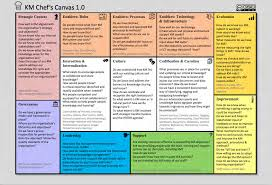

# Grundlagen

## Ein zeitgemäßes Verständnis von Organisationen

[Organisationen](https://de.wikipedia.org/wiki/Organisation) als Teil der Gesellschaft gibt es in vielen Formen und Größen, z.B. Unternehmen, Schulen, Vereine und Parteien. Man weiß intuitiv, wann man es mit einer Organisation zu tun hat. Den Begriff Organisation zu definieren, ist aber nicht ganz so leicht. Der folgende Ausflug in die Organisationstheorie soll ein gemeinsames Verständnis des Organisationsbegriffs ermöglichen.

### Zweck, Mitgliedschaft und Hierarchie

Für die Entwicklung Lernender Organisationen ist ein Grundverständnis von [Organisationstheorie](https://de.wikipedia.org/wiki/Organisationstheorie) und [Systemtheorie](https://de.wikipedia.org/wiki/Systemtheorie), insbesondere [komplexe adaptive System](https://de.wikipedia.org/wiki/Komplexes_adaptives_System) und [soziotechnische Systeme](https://de.wikipedia.org/wiki/Soziotechnisches_System), notwendig. Ein System besteht aus Einzelteilen und ist von seiner Umwelt abgegrenzt. Ein Unternehmen wäre danach z.B. von der Gesellschaft (Umwelt) abgegrenzt, gleichzeitig besteht es aus Abteilungen, Menschen und Prozessen (Einzelteile).

Der Soziologe Niklas Luhmann ist eine Organisation durch drei Merkmale gekennzeichnet (s.a. Kühl, S.: [Organisationen - eine sehr kurze Einführung](https://amzn.to/3jCIVtW)):

1. **Zweck:** der selbst gegebene Zweck der Organisation dient als roter Faden für alles organisatorische Handeln.
2. **Mitgliedschaft:** die Organisation kann über den Ein- und Austritt von Mitglieder entscheiden.
3. **Hierarchien:** durch die Gliederung des Zwecks der Organisation in Unterzwecke und die Übertragung von Verantwortung für Unterzwecke entstehen hierarchische Verantwortungsstrukturen. 

[Stefan Kühl](https://www.linkedin.com/in/stefan-k%C3%BChl-7875213/) unterscheidet mit "Maschine", "Spiel" und "Fassade" drei Seiten der Organisation. Die Fassade beschreibt die Schauseite der Organisation in Richtung ihrer Umwelt ("Wir sind die Besten"). Der Begriff Maschine beschreibt das berechenbare Verhalten einer Organisation eine Leistung zu erbringen (Effizienz und Effektivität). Mit Spiel ist die Lebendigkeit der Organisation auch abseits des offiziellen Regelwerks gemeint (Informale Organisation).

### 2 Betriebssysteme, 1 Organisation

Die Ursprünge der Organisationtheorie liegen in der Organisation von bürokratischen und militärischen Systemen (z.B. [Max Weber](https://de.wikipedia.org/wiki/Max_Weber), [Henri Fayol](https://de.wikipedia.org/wiki/Henri_Fayol), [Frederick W. Taylor](https://de.wikipedia.org/wiki/Frederick_Winslow_Taylor), [Sunzi](https://de.wikipedia.org/wiki/Sunzi)). [Bürokratische Strukturen](https://de.wikipedia.org/wiki/B%C3%BCrokratie) mit einfachen [Hierarchien](https://de.wikipedia.org/wiki/Hierarchie) funktionieren gut, solange die Umwelt einer Organisation stabil ist und sich nur langsam wandelt. Im 21. Jahrhundert haben jedoch viele Organisationen Schwierigkeiten, mit der zunehmenden Geschwindigkeit des Wandels mitzuhalten oder gar den Wandel positiv zu gestalten (s.a. Kotter., J.: Accelerate: strategischen Herausforderungen schnell, agil und kreativ begegnen).

Das Problem erklärt [John Kotter](https://www.linkedin.com/in/johnkotter/) sehr anschaulich im Video [Accelerate! The Evolution of the 21st Century Organization](https://www.youtube.com/watch?v=Pc7EVXnF2aI). Die formale Organisation ermöglicht Stabilität und vorhersehbares Verhalten der Organisation. Um auf Wandel schnell reagieren zu können braucht es neben der Hierarchie aber auch eine Netzwerk-Struktur, die dynamisch und flexibel reagieren kann. Hierbei geht es nicht um eine Entweder-Oder-Entscheidung. Eine Organisation muss die für sie richtige Balance zwischen Stabilität und Agilität finden. Der Stabilität-Agilität-Schieberegler muss für unterschiedliche Teile der Organisation i.d.R. unterschiedlich eingestellt werden (z.B. in der Produktion mehr Stabilität, in der Entwicklung mehr Agilität).

Die notwendige Organisationsstruktur nennt Kotter duales Betriebssystem (Dual Operating System). Das duale Betriebssystem besteht aus Hierarchie auf der einen und Netzwerk auf der anderen Seite. Das Netzwerk besteht aus einer sog. Führungskoalition (Guiding Coalition) als Sonne im Zentrum und strategischen Initiativen (Planeten) und Subinitiativen (Monde) außen herum. Die Netzwerk-Struktur ist dynamischer, als die Hierarchie. Initiativen können jederzeit gestartet, gestoppt, kombiniert oder geteilt werden.

](images/dual-operating-system.gif)

Der Führungskoalition als Kern der Netzwerkstruktur kommt im dualen Betriebssystem eine besondere Bedeutung zu. Sie besteht aus Mitarbeitenden aus allen Bereichen der Organisation, die ein starkes Dringlichkeitsgefühl für die Veränderung der Organisation haben und eine Führungsrolle (nicht notwendigerweise hierarchische Führung) im Wandel übernehmen wollen. Das Kernteam besitzt die notwendige Motivation, das Engagement, das Netzwerk, die Fähigkeiten und die Informationen, um seiner Rolle als Kern der Netzwerkstruktur gerecht zu werden.

Kotter benennt folgende 5 Prinzipien für ein gut funktionierendes duales Betriebssystem:

1.  Wichtige Veränderungen werden von vielen Mitarbeitenden aus allen Bereichen vorangetrieben und nicht nur von den üblichen Auserwählten
2. Es herrscht eine Haltung des Wollens und nicht des Müssens
3. Der Antrieb kommt aus dem Herzen und dem Kopf, nicht nur aus dem Kopf
4. Es findet viel mehr Führung statt und nicht nur mehr Management
5. Es gibt eine untrennbare Partnerschaft von Hierarchie und Netzwerk, nicht nur eine optimierte Hierarchie

Die Notwendigkeit der dualen Betrachtung zeitgemäßer Organisationsformen wird neben Kotter noch in vielen weiteren Quellen aufgegriffen. Im Folgenden eine kleine Auswahl von Beispielen:

* Agilität und Stabilität in [Agility: It rhymes with stability](https://www.mckinsey.com/business-functions/organization/our-insights/agility-it-rhymes-with-stability) von McKinsey.
* Dynamikrobuste Organisationen mit blauer und roter Seite in [Abbildungen und Erläuterungen
  zu den Denkwerkzeugen dynamikrobuster Höchstleister](http://dynamikrobust.com/wp-content/uploads/2016/03/Denkzettel-1-29-komplett.pdf) von Gerhard Wohland.
* Organisationale Ambidextrie mit Exploitation (Ausbeuten & Effizienz) und Exploration (Lernen & Innovation) in [Organizational Ambidexterity: Past, Present and Future](https://www.hbs.edu/faculty/Publication%20Files/O%27Reilly%20and%20Tushman%20AMP%20Ms%20051413_c66b0c53-5fcd-46d5-aa16-943eab6aa4a1.pdf).
* Management 2.0 in [The Future of Management](https://amzn.to/3glWhsA) von Gary Hamel.

### Von der Maschine zu Gehirn und Organismus als Metapher

Um die Wichtigkeit der lebendigen, dynamischen, kreativen und menschlichen Seite der Organisation zu betonen, bietet sich ein Wechsel der Metapher an, mit der über die Organisation gesprochen wird. Oftmals wird von Organisationen wie von Maschinen gesprochen, die produktiv funktionieren sollen und in denen die Menschen nur ein Zahnrädchen darstellen, das bei Defekt einfach ausgetauscht werden kann (schön dargestellt im Film [Moderne Zeiten](https://www.youtube.com/watch?v=HAPilyrEzC4) mit Charlie Chaplin).

Mit dem Übergang von [Industriegesellschaft](https://de.wikipedia.org/wiki/Industriegesellschaft) zu [Wissensgesellschaft](https://de.wikipedia.org/wiki/Wissensgesellschaft) wurden die Wissensarbeiter ([Knowledge Worker](https://en.wikipedia.org/wiki/Knowledge_worker)) zum zentrallen Wertschöpfungsfaktor von Organisationen, Maschinen und Computer dagegen leicht austauschbar. Die Herausforderungen, die sich daraus für die Führung und Gestaltung von Organisationen im 21. Jahrhundert ergeben, fasst Peter Drucker in diesem Zitat anschaulich zusammen:

> The most important, and indeed the truly unique, contribution of  management in the 20th century was the fifty-fold increase in the  productivity of the MANUAL WORKER in manufacturing. The most important  contribution management needs to make in the 21st century is similarly  to increase the productivity of KNOWLEDGE WORK and the KNOWLEDGE WORKER.

Um dieser notwendigen "Re-Humanisierung" der Organisations- und Arbeitswelt gerecht zu werden sollte in der Sprache eher das Gehirn oder ein Organismus denn die Maschine oder der Roboter als Metapher verwendet werden. 

### Organisationskultur

Neben der Struktur der Organisation gewinnt auch die organisationale Kultur für den Erfolg der Organisation immer mehr an Bedeutung. Der Begriff Kultur wir hierbei aber sehr unterschiedlich verwendet ("Wie wir hier arbeiten", "Unsere Werte", "Mentalität und Mindset" etc.).

Der Sozialwissenschaftler [Edgar Schein](https://de.wikipedia.org/wiki/Edgar_Schein) hat mit seinem [Kultureben-Modell](https://de.wikipedia.org/wiki/Kulturebenen-Modell) eine gute Darstellung für die verschiedenen Ansatzpunkte für den Kulturwandel in Organisationen geschaffen. Das Modell besteht aus drei Ebenen, die sich wechselseitig beeinflussen (Schein, E.: [Organisationskultur](https://amzn.to/2D4fosE)):

* **Artefakte:** sichtbare Organisationsstrukturen und -prozesse
* **Öffentlich probagierte Werte:** Strategien, Ziele Philosophien
* **Grundlegende unausgesprochene Annahmen:** unbewusst, für selbstverständlich gehaltene Überzeugungen, Wahrnehmungen, Gedanken und Gefühle

Schein weist aber auch darauf hin, das die drei Ebenen "Manifestationen von Kultur", nicht die Kultur selber sind. Aus dem Modell ergeben sich für einen kulturellen Wandel die Ansatzpunkte Veränderung von Artefakten, probagieren neuer Werte sowie das Hinterfragen von Grundannahmen.

Die drei Ebenen können aufgrund der Merkmale Sichtbarkeit und einfacher Möglichkeiten der Veränderung auch als Wasserlilie mit den Blättern (sichtbar, oberhalb des Wasserspiegels), dem Stängel (verschwommen, im Wasser) und den Wurzeln (unsichtbar, im Boden) dargestellt werden:

## Wandel von Organisationen

Warum müssen wir uns überhaupt mit der Veränderung von Organisationen beschäftigen? Können wir nicht einfach das "richtige" Organisationsmodell finden und Organisationen dann immer (oder zumindest für lange Zeit) so belassen? Es gibt zwei wesentliche Treiber für die Veränderungen von Organisationen:

1. **Änderungen in der Umwelt (reaktiv):** Entwicklungen wie die Globalisierung, die Digitalisierung und der technologische Fortschritt führen dazu, dass sich Organisationen an geänderte Rahmenbedingungen anpassen müssen.
2. **Motivation der Organisation (proaktiv):** im Rahmen ihrer Entwicklung verfolgen Organisationen neue Ziele oder sehen sich mit Problemen konfrontiert, die einen Wunsch zur Veränderung aufkommen lassen.

**ProTip:** Starte immer mit dem Warum (s.a. Sinek, S.: [Start With Why](https://amzn.to/2WRLEWK), Video [Wie große Führungspersönlichkeiten zum Handeln inspirieren](https://www.youtube.com/watch?v=qp0HIF3SfI4)): damit du beim Start einer Initiative zur Entwicklung der Organisation ein klares Ziel vor Augen hast und keinen kurzfristigen Moden hinterherläufst ist es wichtig, sich den Grund genau zu überlegen. Gibt es einen guten Grund die Organisation zu verändern? Kommt der Grund eher von außen (z.B. [Megatrends](https://de.wikipedia.org/wiki/Trend_(Soziologie)#Megatrend), [Kondratjew-Zyklen](https://de.wikipedia.org/wiki/Kondratjew-Zyklus) oder [gesellschaftlichem Wandel](https://de.wikipedia.org/wiki/Sozialer_Wandel))? Oder gibt es einen intern Grund, sich verändern zu wollen (z.B. Digitale Transformation, Agile Transformation)?

### Veränderung Top-down oder Bottom-up?

... (Kotter, J.: [8 Steps to Accelerate Change](https://www.kotterinc.com/research-and-perspectives/8-steps-accelerating-change-ebook/)) ...

... Graswurzelbewegung, soziale Bewegung ...

**8 Beschleuniger der Veränderung:**

... (Kotter, J.: [Accelerate!](https://hbr.org/2012/11/accelerate)) ...

1. Ein Gefühls der Dringlichkeit rund um eine große Chance erzeugen.
2. Eine Führungskoalition auf- und ausbauen.
3. Eine strategische Vision formulieren und Initiativen zur Veränderung starten, um die große Chance zu nutzen.
4. Vision und Strategie kommunizieren, um Engagement zu erzeugen und eine "Armee von Freiwilligen" anzuziehen.
5. Beschleunigen Sie die Eine Bewegung in Richtig Vision und Chance entwickeln und sicherstellen, dass das Netzwerk Barrieren beseitigt.
6. Die sichtbaren, bedeutenden und kurzfristigen Siege feiern.
7. Niemals nachlassen. Weiterhin aus Erfahrungen lernen. Den Sieg nicht zu früh erklären.
8. Strategische Veränderungen in der Kultur verankern.

Dancing guy, soziale Bewegung (Buch Kluges)

### Middle-Up-Down Management

... (Nonaka, I.: [Toward Middle-Up-Down Management](https://sloanreview.mit.edu/article/toward-middleupdown-management-accelerating-information-creation/)) ...

### Gleicher's Formel für Veränderung

... (Wikipedia-Artikel (en) [Formula for Change](https://en.wikipedia.org/wiki/Formula_for_change#cite_note-3))

C = D x V x F > R

### Lead by example - Mit gutem Beispiel vorangehen

...

## Die Lernende Organisation und ihre Feinde

Die Veränderung der Organisation ist immer mit Lernen auf individueller und/oder organisationaler Ebene verbunden. Die Idee der Lernenden Organisation geht zurück in die 1990er Jahre und die Gründung des MIT Center for Organizational Learning mit [Peter Senge](https://de.wikipedia.org/wiki/Peter_M._Senge) als als Direktor sowie [Edgar Schein](https://de.wikipedia.org/wiki/Edgar_Schein) und [Chris Argyris](https://de.wikipedia.org/wiki/Chris_Argyris) als Schlüsselpersonen. Ähnlich wie das Konzept des [Wissensmanagements](https://de.wikipedia.org/wiki/Wissensmanagement) betont das organisationale Lernen die Bedeutung von Lernen und Wissen für den Erfolg von Organisationen.

Eine Lernende Organisation unterscheidet sich von einer Nicht-Lernenden Organisation durch eine Reihe von Merkmalen:

> Eine lernende Organisation ist eine Organisation, die in der Lage ist, Wissen zu schaffen, zu erwerben, zu interpretieren, zu übertragen und zu bewahren und ihr Verhalten gezielt zu ändern, um neues Wissen und neue Einsichten zu reflektieren. 

### Die 3 Bausteine der Lernenden Organisation

Um eine derartige Organisation zu entwickeln sind nach David Garvin drei Bausteine notwendig (Garvin, D.: [Learning Action - A Guide To Putting The Learning Organization To Work](https://amzn.to/2BqOvyk)):

1. Führung, die das Lernen stärkt
2. Konkrete Lernprozesse
3. Eine unterstützende Lernumgebung

... PDCA ...

### Die 5 Disziplinen der Lernenden Organisation

Nach Peter Senge muss die Organisation fünf Disziplinen meistern, um ihre Fähigkeiten ständig weiterzuentwickeln, um ihre höchsten Ziele zu verwirklichen und wahrhaftige Lernfähigkeit zu entwickeln (Senge, P.: [Die fünfte Disziplin - Kunst und Praxis der lernenden Organisation](https://amzn.to/2D54BOw)):

1. Systemdenken
2. Personal Mastery - die Disziplin der Selbstführung und Persönlichkeitsentwicklung
3. Mentale Modelle
4. Eine gemeinsame Vision entwickeln
5. Team-Lernen

Zu der ... Lernkultur - Lernprozesse - Lernumgebung ...

### Das Lernen Lernen in 2 Schleifen

... [Organisationales Lernen](https://de.wikipedia.org/wiki/Organisationales_Lernen) ...

### Das Wissensmanagement-System nach ISO 30401

... ([ISO 30401:2018 Knowledge management systems — Requirements](https://www.iso.org/standard/68683.html)) ...

... Knowledge Mangement Chef's Canvas ([KM Cookbook](https://www.iso30401.com/)) [Folien](https://www.mykmroundtable.org/uploads/3/8/2/6/38261647/stories_and_strategies_for_organisations_exploring_knowledge_management_standard_iso_30401vkul.pdf) ...

### Feinde der Lernenden Organisation

...

## Eine Lernende Organisation kultivieren

### Die Koalition des Lernens

...

### Die Lernende Organisation als Nordstern

...

### Open Space Learning als Taktgeber

... Sponsor, Theme (one big opportunity), Coaching Role (lernOS Coach), Proceedings

Experimentieren - Wissen

Iteration - Lernen

Kontinuierliche Verbesserung - Effektivität und Effizienz

Lernen in Iterationen mit OKR

... jeder in der Koalition des Lernens sollte den lernOS for You Guide durchgemacht haben ...

### Die Armee der Freiwilligen

... Army of Volunteers ...

----

Im **lernOS Plan** werden die Maßnahmen entlang der Handlungsfelder ausgeplant. Der Planungszeitraum kann in der Praxis sehr unterschiedlich sein. Es empfiehlt sich in Anlehnung an das agile Projektmanagement „auf Sicht" zu planen und längere Zeiträume durch kürzere Etappen (sog. Sprints) mit Zwischen-Reviews zu unterteilen.

Wird beispielsweise über einen Zeitraum von drei oder sechs Monaten geplant, kann dieser in 4-wöchigen Sprints mit Sprint-Reviews geteilt und mit einem Review nach Abschluss des Zeitraums versehen werden.

Der Einsatz eines neuen lernOS Tools benötigt in der Praxis meist etwas Übung und Begleitung. Diesen Zweck erfüllen die **lernOS Sprints**, bei denen der Einsatz eines Tools geplant, umgesetzt und in mehreren
Iterationen (z.B. 3 x 1 Monat) auf die eigenen Bedürfnisse angepasst wird.

In regelmäßigen Abständen (z.B. einmal pro Quartal) wird das gesamte Organisationssystem im **lernOS Review** auf den Prüfstand gestellt. Für Scope, Strategie, Plan und ausgewählten Tools wird entschieden, ob diese wie bisher weitergeführt werden sollen oder verbessert/angepasst werden müssen. Für das lernOS Review sollte ausreichend Zeit zur Verfügung stehen (z.B. 1 Tag/Halbjahr). Es empfiehlt sich, das Review außerhalb der gewohnten Umgebung durchzuführen, um Störungen zu vermeiden und Kreativität zu fördern.

### Die lernOS Toolbox für Lernende Organisationen

... lernOS Toolbox + X ...

Ersatz für y

Im Folgenden wird die **lernOS Toolbox** im Detail vorgestellt. Zu jedem Tool gibt es unter lernos.org eine zugehörige Webseite mit weiterführenden Informationen.

1.  **Barcamp:** Ein Barcamp (auch Unkonferenz) ist eine Konferenz, bei der die Inhalte von den Teilehmern innerhalb eines vorgegebenen Rahmens selber gestaltet werden.
2.  **Community of Practice:** Eine Community of Practice (CoP) ist eine Gruppe von Personen mit einem gemeinsamen Interesse, die durch regelmäßige Interaktion voneinander lernen.
3.  **Coworking:** Coworking steht für neue Formen des gemeinschaftlichen Arbeitens: Arbeitsraum und Ausstattung werden gemeinsam genutzt, woraus neue Ideen und Projekte entstehen.
4.  **Design Thinking:** Das Design Thinking ist eine Innovationsmethode, bei der Ideen in fünf Phasen iterativ entwickelt und getestet werden.
5.  **Enterprise Social Network:** Ein Enterprise Social Network (ESN) ist eine virtuelle Plattform in einem Unternehmen, die die Identifikation, Kommunikation und Interaktion von Menschen unterstützt.
6.  **Erklärvideo:** Ein Erklärvideo ist ein kurzes Video (typisch sind wenige Minuten), in dem die wichtigsten Aspekte eines komplexen Themas erläutert werden.
7.  **Expert Debriefing:** Das Expert Debriefing ist eine Methode zum Wissenstransfer von Experten auf ein oder mehrere Nachfolger (z.B. bei Ruhestand, Abteilungswechsel, Kündigung, Sabattical, Elternzeit, Job Rotation).
8.  **Fedex Day:** Der FedEx Day ist ein Veranstaltungsformat, bei dem die Teilnehmer gemeinsam an einem Tag ein auslieferungsfähiges Produkt erzeugen.
9.  **Future Backwards:** Das Future Backwards ist eine Strategiemethode zur Reflektion der Vergangenheit, zur Formulierung einer Vision für die Zukunft und zur Definition einer Strategie für die Umsetzung.
10.  **Getting Things Done:** Getting Things Done (GTD) ist eine Selbstmanagement-Methode für Wissensarbeiter.
11.  **Hackathon:** Ein Hackaton (Kombination aus „Hacken" und „Marathon") ist eine Veranstaltung, in deren Verlauf kollaborativ an bestehender Software oder anderen Ergebnissen gearbeitet wird.
12.  **Lessons Learned:** Lessons Learned ist ein Prozess, in dem Erfahrungen aus der Praxis inkl. Schlussfolgerungen kommuniziert oder dokumentiert werden.
13.  **Massive Open Online Course:** Ein Massive Open Online Course (MOOC) ist ein Kurs, der frei zugänglich ist (open), online stattfindet und eine große Menge von Teilnehmern (massive) hat.
14.  **Podcast:** Ein Podcast besteht aus einer Sammlung von Audio-Dateien, die auf einer Webseite zum automatischen Download zur Verfügung gestellt wird.
15.  **Screencast:** Ein Screencast ist ein Video, das die Interaktion auf einem Computerbildschirm wahlweise mit oder ohne Ton darstellt.
16.  **Scrum:** Scrum ist eine Methode des Projektmanagements, um Projekte agil und partizipativ zu führen.
17.  **Weblog:** Ein Weblog (auch Blog) ist eine persönliche Webseite im Tagebuch-Format, d.h. die einzelnen Weblog-Einträge werden chronologisch rückwärts angezeigt.
18.  **Wiki:** Ein Wiki (Hawaiisch für „schnell") ist eine Sammlung von Webseiten, die von den Nutzern gelesen und bearbeitet werden können.
19.  **Wissenslandkarte:** Eine Wissenslandkarte ist eine graphische Darstellung von Wissensgebieten und deren Zusammenhängen.
20.  **Working Out Loud:** Working Out Loud (WOL) ist eine Methode zum strategischen Netzwerken und offenen Teilen von Inhalten.

## Link- und Literaturliste

**Links:**

1. D. A. Garvin, A. C. Edmondson, und F. Gino, „Is Yours a Learning Organization?", *Harvard Business Review*, März 2008. 

**Literatur:**

1. Deutsches Institut für Normung e.V., Hrsg., „Qualitätsmanagementsysteme Anforderungen (ISO 9001:2015); Deutsche und Englische Fassung". Nov-2015.\[3\] R. L. Chase, „How to Become a MAKE Winner". 2016.
