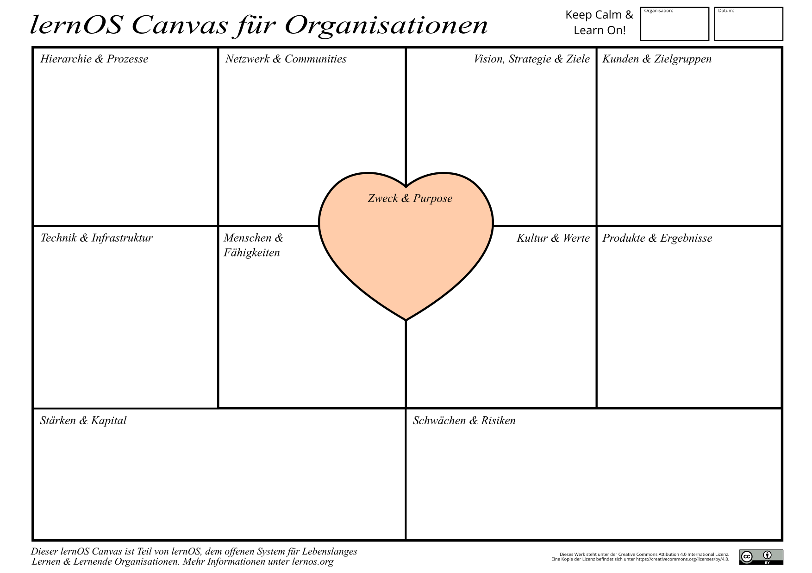

# Lernpfad

Beim ersten Durchlauf der Koalition des Lernens durch den Lernpfad werden die Grundlagen für die nachhaltige Kultivierung einer Lernenden Organisation geschaffen. Die Koalition des Lernens hat sich formiert und wird in der Organisation mit ihren Zielen sichtbar. Das erste wichtige Thema für die Kultivierung der Lernenden Organisation ist identifiziert, beschrieben und als Motto des ersten Open Space des Lernens festgelegt. Das erste OSL hat stattgefunden, im Protokoll sind konkrete Lern-Aktivitäten und -Initiativen dokumentiert. Der nächste OSL ist terminiert.

1. **Die eigene Organisation verstehen (Kata)**
   Analysiere mit dem lernOS Canvas für Organisationen die aktuelle Situation deiner Organisation und identifiziere mögliche Handlungsfelder.
2. **Den Nordstern der Organisation finden (Kata)**
   Nutze die Methode Future Backwards, um deine Vision deiner Organisation als Lernender Organisation zu ermitteln.
3. **Die Koalition des Lernens formieren (Kata)**
   Gründe gemeinsam mit mindestens zwei Mitsteiter*innen die Koalition des Lernens und mache diese in der Organisation sichtbar.
4. **Das Motto für den Open Space des Lernens festlegen (Boxenstopp 1) (Kata)**
   Suche nach einer großen Chance des Lernens in deiner Organisation und lege dieses als Motto für das Open Space des Lernens fest. Plane je nach Motto auch Marktplätze des Wissens im Open Space ein (z.B. um über Methoden und Tools zu informieren).
5. **Den Sponsor mit ins Boot holen (Kata)**
   Lade den Sponsor ein und stelle das bisher Erarbeitete vor. Sammle Feedback und Ideen. Hole dir Hilfe bei Barrieren und grünes Licht für das weitere Vorgehen.
6. **Die Einladung zum Open Space des Lernens verschicken (Kata)**
   Erstelle und verschicke eine Einladung zum Open Space des Lernens an die ganze Organisation. Lass darin den Sponsor die Bedeutung der Veranstaltung erklären, stelle das Motto so wie den Ablauf vor und weise auf die Freiwilligkeit der Teilnahme hin.
7. **Initiativen, Communities, Netzwerke und informelle "Leader" einbinden (Kata)**
   Suche nach Gruppen und Einzelpersonen in der Organisation (ggf. auch außerhalb), für die das Motto des Open Space bedeutsam ist und lade sie aktiv zur Teilnahme ein.
8. **Räume und Infrastruktur für das Open Space vorbereiten (Boxenstopp 2) (Kata)**
   Bereite alles vor, was für die Durchführung des Open Space des Lernens in Präsenz, virtuell oder hybrid noch notwendig ist (z.B. Materialien, Ausdrucke, digitale Kommunikationsplattform, WiFi).
9. **Das Open Space Protokoll vorbereiten (Kata)**
   Bereite das Protokoll in einem geeigneten Medium so vor, dass Session-Geber und Teilnehmer ihre Ergebnisse darin leicht dokumentieren können und das finale Protokoll idealerweise wenige Stunden nach der Veranstaltung verfügbar ist (max. 24 Stunden).
10. **Ein letzter "Call for Participation" (Kata)**
    Rufe alle Teilnehmer des Open Space über die digitale Kommunikationsplattform auf, sich und ihre Wünsche an die Veranstaltung vorzustellen sowie mögliche Open Space Sessions auf dem Session-Marktplatz einzutragen.
11. **Der Open Space des Lernens findet statt (Kata)**
    Moderiere das Open Space des Lernens und erstelle das Open Space Protokoll. Identifiziere die Aktivitäten und Initiativen, die du im kommenden Sprint "Auf dem Radar" behalten möchtest.

