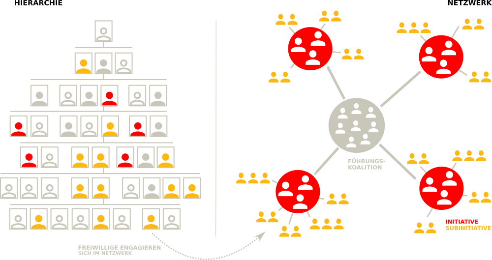
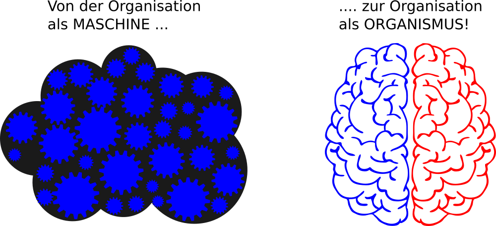
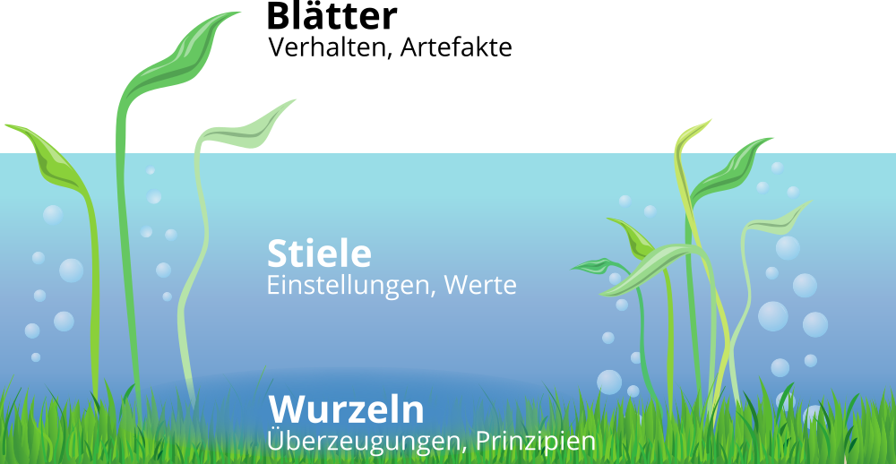

# Grundlagen

## Ein zeitgemäßes Verständnis von Organisationen

[Organisationen](https://de.wikipedia.org/wiki/Organisation) als Teil der Gesellschaft gibt es in vielen Formen und Größen, z.B. Unternehmen, Schulen, Vereine und Parteien. Man weiß intuitiv, wann man es mit einer Organisation zu tun hat. Den Begriff Organisation zu definieren, ist aber nicht ganz so leicht. Der folgende Ausflug in die Organisationstheorie soll ein gemeinsames Verständnis des Organisationsbegriffs ermöglichen.

### Zweck, Mitgliedschaft und Hierarchie

Für die Entwicklung Lernender Organisationen ist ein Grundverständnis von [Organisationstheorie](https://de.wikipedia.org/wiki/Organisationstheorie) und [Systemtheorie](https://de.wikipedia.org/wiki/Systemtheorie), insbesondere [komplexe adaptive System](https://de.wikipedia.org/wiki/Komplexes_adaptives_System) und [soziotechnische Systeme](https://de.wikipedia.org/wiki/Soziotechnisches_System), notwendig. Ein System besteht aus Einzelteilen und ist von seiner Umwelt abgegrenzt. Ein Unternehmen wäre danach z.B. von der Gesellschaft (Umwelt) abgegrenzt, gleichzeitig besteht es aus Abteilungen, Menschen und Prozessen (Einzelteile).

Laut Soziologe Niklas Luhmann ist eine Organisation durch drei Merkmale gekennzeichnet (s.a. Kühl, S.: [Organisationen - eine sehr kurze Einführung](https://amzn.to/3jCIVtW)):

1. **Zweck:** der selbst gegebene Zweck der Organisation dient als roter Faden für alles organisatorische Handeln.
2. **Mitgliedschaft:** die Organisation kann über den Ein- und Austritt von Mitglieder entscheiden.
3. **Hierarchien:** durch die Gliederung des Zwecks der Organisation in Unterzwecke und die Übertragung von Verantwortung für Unterzwecke entstehen hierarchische Verantwortungsstrukturen. 

[Stefan Kühl](https://www.linkedin.com/in/stefan-k%C3%BChl-7875213/) unterscheidet mit "Maschine", "Spiel" und "Fassade" drei Seiten der Organisation. Die Fassade beschreibt die Schauseite der Organisation in Richtung ihrer Umwelt ("Wir sind die Besten"). Der Begriff Maschine beschreibt das berechenbare Verhalten einer Organisation eine Leistung zu erbringen (Effizienz und Effektivität). Mit Spiel ist die Lebendigkeit der Organisation auch abseits des offiziellen Regelwerks gemeint (Informale Organisation).

### 2 Betriebssysteme, 1 Organisation

Die Ursprünge der Organisationtheorie liegen in der Organisation von bürokratischen und militärischen Systemen (z.B. [Max Weber](https://de.wikipedia.org/wiki/Max_Weber), [Henri Fayol](https://de.wikipedia.org/wiki/Henri_Fayol), [Frederick W. Taylor](https://de.wikipedia.org/wiki/Frederick_Winslow_Taylor), [Sunzi](https://de.wikipedia.org/wiki/Sunzi)). [Bürokratische Strukturen](https://de.wikipedia.org/wiki/B%C3%BCrokratie) mit einfachen [Hierarchien](https://de.wikipedia.org/wiki/Hierarchie) funktionieren gut, solange die Umwelt einer Organisation stabil ist und sich nur langsam wandelt. Im 21. Jahrhundert haben jedoch viele Organisationen Schwierigkeiten, mit der zunehmenden Geschwindigkeit des Wandels mitzuhalten oder gar den Wandel positiv zu gestalten (s.a. Kotter., J.: Accelerate: strategischen Herausforderungen schnell, agil und kreativ begegnen).

Das Problem erklärt [John Kotter](https://www.linkedin.com/in/johnkotter/) sehr anschaulich im Video [Accelerate! The Evolution of the 21st Century Organization](https://www.youtube.com/watch?v=Pc7EVXnF2aI). Die formale Organisation ermöglicht Stabilität und vorhersehbares Verhalten der Organisation. Um auf Wandel schnell reagieren zu können braucht es neben der Hierarchie aber auch eine Netzwerk-Struktur, die dynamisch und flexibel reagieren kann. Hierbei geht es nicht um eine Entweder-Oder-Entscheidung. Eine Organisation muss die für sie richtige Balance zwischen Stabilität und Agilität finden. Der Stabilität-Agilität-Schieberegler muss für unterschiedliche Teile der Organisation i.d.R. unterschiedlich eingestellt werden (z.B. in der Produktion mehr Stabilität, in der Entwicklung mehr Agilität).

Die notwendige Organisationsstruktur nennt Kotter duales Betriebssystem (Dual Operating System). Das duale Betriebssystem besteht aus Hierarchie auf der einen und Netzwerk auf der anderen Seite. Das Netzwerk besteht aus einer sog. Führungskoalition (Guiding Coalition) als Sonne im Zentrum und strategischen Initiativen (Planeten) und Subinitiativen (Monde) außen herum. Die Netzwerk-Struktur ist dynamischer, als die Hierarchie. Initiativen können jederzeit gestartet, gestoppt, kombiniert oder geteilt werden.

Der Führungskoalition als Kern der Netzwerkstruktur kommt im dualen Betriebssystem eine besondere Bedeutung zu. Sie besteht aus Mitarbeitenden aus allen Bereichen der Organisation, die ein starkes Dringlichkeitsgefühl für die Veränderung der Organisation haben und eine Führungsrolle (nicht notwendigerweise hierarchische Führung) im Wandel übernehmen wollen. Das Kernteam besitzt die notwendige Motivation, das Engagement, das Netzwerk, die Fähigkeiten und die Informationen, um seiner Rolle als Kern der Netzwerkstruktur gerecht zu werden.

Kotter benennt folgende 5 Prinzipien für ein gut funktionierendes duales Betriebssystem:

1.  Wichtige Veränderungen werden von vielen Mitarbeitenden aus allen Bereichen vorangetrieben und nicht nur von den üblichen Auserwählten
2. Es herrscht eine Haltung des Wollens und nicht des Müssens
3. Der Antrieb kommt aus dem Herzen und dem Kopf, nicht nur aus dem Kopf
4. Es findet viel mehr Führung statt und nicht nur mehr Management
5. Es gibt eine untrennbare Partnerschaft von Hierarchie und Netzwerk, nicht nur eine optimierte Hierarchie

Die Notwendigkeit der dualen Betrachtung zeitgemäßer Organisationsformen wird neben Kotter noch in vielen weiteren Quellen aufgegriffen. Im Folgenden eine kleine Auswahl von Beispielen:

* Agilität und Stabilität in [Agility: It rhymes with stability](https://www.mckinsey.com/business-functions/organization/our-insights/agility-it-rhymes-with-stability) von McKinsey.
* Dynamikrobuste Organisationen mit blauer und roter Seite in [Abbildungen und Erläuterungen
  zu den Denkwerkzeugen dynamikrobuster Höchstleister](http://dynamikrobust.com/wp-content/uploads/2016/03/Denkzettel-1-29-komplett.pdf) von Gerhard Wohland.
* Organisationale Ambidextrie mit Exploitation (Ausbeuten & Effizienz) und Exploration (Lernen & Innovation) in [Organizational Ambidexterity: Past, Present and Future](https://www.hbs.edu/faculty/Publication%20Files/O%27Reilly%20and%20Tushman%20AMP%20Ms%20051413_c66b0c53-5fcd-46d5-aa16-943eab6aa4a1.pdf).
* Management 2.0 in [The Future of Management](https://amzn.to/3glWhsA) von Gary Hamel.

### Von der Maschine zu Gehirn und Organismus als Metapher

Um die Wichtigkeit der lebendigen, dynamischen, kreativen und menschlichen Seite der Organisation zu betonen, bietet sich ein Wechsel der Metapher an, mit der über die Organisation gesprochen wird. Oftmals wird von Organisationen wie von Maschinen gesprochen, die produktiv funktionieren sollen und in denen die Menschen nur ein Zahnrädchen darstellen, das bei Defekt einfach ausgetauscht werden kann (schön dargestellt im Film [Moderne Zeiten](https://www.youtube.com/watch?v=HAPilyrEzC4) mit Charlie Chaplin).

Mit dem Übergang von [Industriegesellschaft](https://de.wikipedia.org/wiki/Industriegesellschaft) zu [Wissensgesellschaft](https://de.wikipedia.org/wiki/Wissensgesellschaft) wurden die Wissensarbeiter ([Knowledge Worker](https://en.wikipedia.org/wiki/Knowledge_worker)) zum zentrallen Wertschöpfungsfaktor von Organisationen, Maschinen und Computer dagegen leicht austauschbar. Die Herausforderungen, die sich daraus für die Führung und Gestaltung von Organisationen im 21. Jahrhundert ergeben, fasst Peter Drucker in diesem Zitat anschaulich zusammen:

> The most important, and indeed the truly unique, contribution of  management in the 20th century was the fifty-fold increase in the  productivity of the MANUAL WORKER in manufacturing. The most important  contribution management needs to make in the 21st century is similarly  to increase the productivity of KNOWLEDGE WORK and the KNOWLEDGE WORKER.

Um dieser notwendigen "Re-Humanisierung" der Organisations- und Arbeitswelt gerecht zu werden sollte in der Sprache eher das Gehirn oder ein Organismus denn die Maschine oder der Roboter als Metapher verwendet werden:

### Organisationskultur

Neben der Struktur der Organisation gewinnt auch die organisationale Kultur für den Erfolg der Organisation immer mehr an Bedeutung. Der Begriff Kultur wir hierbei aber sehr unterschiedlich verwendet ("Wie wir hier arbeiten", "Unsere Werte", "Mentalität und Mindset" etc.).

Der Sozialwissenschaftler [Edgar Schein](https://de.wikipedia.org/wiki/Edgar_Schein) hat mit seinem [Kultureben-Modell](https://de.wikipedia.org/wiki/Kulturebenen-Modell) eine gute Darstellung für die verschiedenen Ansatzpunkte für den Kulturwandel in Organisationen geschaffen. Das Modell besteht aus drei Ebenen, die sich wechselseitig beeinflussen (Schein, E.: [Organisationskultur](https://amzn.to/2D4fosE)):

* **Artefakte:** sichtbare Organisationsstrukturen und -prozesse
* **Öffentlich propagierte Werte:** Strategien, Ziele und Philosophien
* **Grundlegende unausgesprochene Annahmen:** unbewusst, für selbstverständlich gehaltene Überzeugungen, Wahrnehmungen, Gedanken und Gefühle

Schein weist aber auch darauf hin, das die drei Ebenen "Manifestationen von Kultur", nicht die Kultur selber sind. Aus dem Modell ergeben sich für einen kulturellen Wandel die Ansatzpunkte Veränderung von Artefakten, probagieren neuer Werte sowie das Hinterfragen von Grundannahmen.

Die drei Ebenen können aufgrund der Merkmale Sichtbarkeit und einfacher Möglichkeiten der Veränderung auch als Wasserlilie mit den Blättern (sichtbar, oberhalb des Wasserspiegels), dem Stängel (verschwommen, im Wasser) und den Wurzeln (unsichtbar, im Boden) dargestellt werden:

