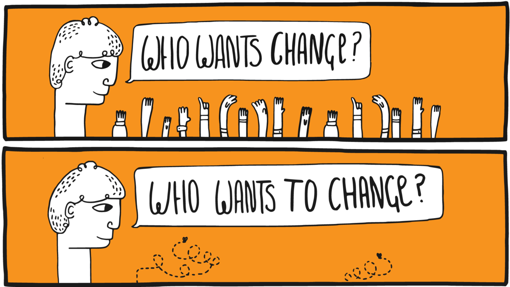

## Veränderung von Organisationen

Organisationen leben nicht unendlich. Die durchschnittliche Lebenserwartung eines US-amerikanischen Unternehmens beispielsweise liegt aktuell bei rund 10 Jahren (s.a. Studie [The Mortality of Companies](https://royalsocietypublishing.org/doi/10.1098/rsif.2015.0120)). In ihrer Lebenszeit durchläuft eine Organisation viele Veränderungsprozesse, die einen von zwei Ausgangspunkte haben kann:

1. **Änderungen in der Umwelt (reaktiv):** Entwicklungen wie Digitalisierung, Globalisierung und der technologische Fortschritt führen dazu, dass sich Organisationen an geänderte Rahmenbedingungen anpassen müssen, um effektiv zu sein oder im Wettbewerb bestehen zu können.
2. **Motivation der Organisation (proaktiv):** im Rahmen ihrer Entwicklung verfolgen Organisationen neue Ziele oder sehen sich mit Problemen konfrontiert, die einen Wunsch zur Veränderung aufkommen lassen (z.B. digitale Transformation, agile Transformation).

Den systematischen Umgang mit Veränderungen nennt man Veränderungs- oder Change Management. Handelt es sich bei der Veränderung um einen fundamentalen und dauerhaften Wandel, spricht man oft auch von Revolution (Industrielle Revolution) oder Transformation (Digitale Transformation, Agile Transformation).

**ProTip:** Starte immer mit dem Warum (s.a. Sinek, S.: [Start With Why](https://amzn.to/2WRLEWK), Video [Wie große Führungspersönlichkeiten zum Handeln inspirieren](https://www.youtube.com/watch?v=qp0HIF3SfI4)): damit du beim Start einer Initiative zur Entwicklung der Organisation ein klares Ziel vor Augen hast und keinen kurzfristigen Moden hinterherläufst ist es wichtig, sich den Grund genau zu überlegen. Gibt es einen guten Grund die Organisation zu verändern? Kommt der Grund eher von außen (z.B. [Megatrends](https://de.wikipedia.org/wiki/Trend_(Soziologie)#Megatrend), [Kondratjew-Zyklen](https://de.wikipedia.org/wiki/Kondratjew-Zyklus) oder [gesellschaftlichem Wandel](https://de.wikipedia.org/wiki/Sozialer_Wandel))? Oder gibt es einen intern Grund, sich verändern zu wollen (z.B. Digitale Transformation, Agile Transformation)?

### Gleicher's Formel für Veränderung

David Gleicher hat sich schon in den 1960er Jahren mit der Frage beschäftigt, wann in Organisationen überhaupt Veränderung geschieht bzw. wie groß die Erfolgsaussichten von Veränderungsinitiativen sind. Das Ergebnis hat er in der Formel für Veränderung (s.a. [Formula for Change](https://en.wikipedia.org/wiki/Formula_for_change#cite_note-3)) zusammengefasst:

Veränderung (Change) geschieht dann, wenn das Produkt aus der Unzufriedenheit mit der aktuellen Situation (Dissatisfaction), der Vision einer positiven Zukunft (Vision) und konkrete erste Schritte in Richtung Vision (First Steps) größer ist, als der Widerstand gegen die Veränderung (Resistance). Da der Kern der Gleichung ein Produkt ist, führt jeder Faktor mit Wert 0 (z.B. Visionslosigkeit, völlige Zufriedenheit mit der Situation) zum Stillstand in der Organisation.

**ProTip:** die Veränderungsformel kann man in Workshops gut dafür verwenden, um in einer Spalte unter jedem Buchstaben konkrete Aussagen zu sammeln und zu bewerten (z.B. "Womit sind wir unzufrieden?", "Wo wollen wir in?", "Welche konkreten Schritte können wir uns vorstellen?", "Mit welchen Widerständen müssen wir rechen?").

### Veränderung Top-down

Beim der Wandel einer Organisation denken viele intuitiv an den Anstoß der Veränderung aus der obersten Leitung, die Definition von Ist- und Soll-Zustand und dem Einsatz sog. [Change Agents](https://de.wikipedia.org/wiki/Change_Agent) zur Begleitung der Veränderung. Die Veränderung ist i.d.R. innerhalb von Monaten oder Jahren abgeschlossen. Viele Veränderungsmaßnahmen, wie beispielsweise eine organisatorische Veränderung oder die Einführung von Software, lassen sich mit so einem Ansatz bewerkstelligen.

Der wohl bekannteste Top-down Change-Management-Ansatz **8-Stufen-Prozess** zur Führung von Veränderungsprozessen (Kotter, J.: Leading Change). Im Jahr 2014 hat John Kotter seinen Veränderungsprozess an die neuen Rahmenbedingungen des 21. Jahrhunderts mit einer erhöhten Veränderungsgeschwindigkeit angepasst (s.a. Kotter, J.: [Accelerate!](https://hbr.org/2012/11/accelerate)). Der neue Ansatz besteht jetzt aus fünf Prinzipien und acht "Beschleunigern":

**Die 5 Prinzipien des Dual Operating System:**

1. Viele Change Agents, nicht nur die üblichen wenigen Ernannten.
2. Ein Mindset des Wollens und nicht des Müssens.
3. Kopf und Herz, nicht nur Kopf.
4. Viel mehr Führung, nicht nur mehr Management.
5. Zwei Systeme, eine Organisation.

**Die 8 Beschleuniger des Dual Operating System:**

1. Ein Gefühl der Dringlichkeit rund um eine große Chance erzeugen
2. Eine Führungskoalition (en: Guiding Coalition) aufbauen und dauerhaft unterstützen
3. Eine strategische Vision und Veränderungsinitiativen rund um die große Chance entwickeln
4. Vision und die Strategie kommunizieren, um Buy-in zu erzeugen und eine wachsende Gruppe Freiwilliger (en: army of volunteers) zu aktivieren
5. Die Bewegung hin zur Vision und zur großen Chance beschleunigen, indem Sie dafür sorgen, dass das Netzwerk Barrieren beseitigt
6. Sichtbare, bedeutende und kurzfristige Siege feiern
7. Niemals aufgeben. Lernen Sie weiter aus Erfahrungen. Erklären Sie den Sieg nicht zu früh
8. Strategische Veränderungen in der Kultur institutionalisieren

### Veränderung Bottom-up

Neben der Veränderung vom oberen Ende der Hierarchie kann der Impuls zur Veränderung auch von unten kommen. In der Gesellschaft spricht man dabei von [sozialen Bewegungen](https://de.wikipedia.org/wiki/Soziale_Bewegung) (z.B. Occupy Wallstreet, Fridays for Future), in Organisationen wird oft der Begriff der Graswurzelbewegung verwendet (z.B. [#gernperDu](http://www.gernperdu.de), [Working Out Loud](https://workingoutloud.com/de/fur-dich)). Gemein ist diesen Bewegungen, dass sie aus einer Gruppe von Personen besteht, die mit verschiedenen Mobilisierungs- und Handlungsstrategien versucht, gesellschaftlichen oder organisatorischen Wandel zu beschleunigen, zu verhindern oder umzukehren. Nach Herbert Blumer (1969) durchläuft eine soziale Bewegung einen fünfstufigen Lebenszyklus vom Auftauchen (emergence) bis zum Rückgang (decline):

Eine Übersicht aktueller Graswurzelbewegungen in Organisationen sind im Buch [Graswurzelinitiativen in Unternehmen: Ohne Auftrag – mit Erfolg!](https://amzn.to/39SjqQX) von Sabine und Alexander Kluge zusammengefasst (s.a. Podcast [Kluges aus der Mitte](https://klugesausdermitte.podigee.io)).

### Veränderung Middle-Up-Down

Die Notwendigkeit, sich als Organisation immer schneller zu verändern, erfordert neue Ansätze. Top-Down-Ansätze erzeugen oft nicht die notwendige Veränderungsbereitschaft in der Breite, Bottom-Up-Ansätze stoßen an die sprichwörtliche "gläserne Decke" und sie verlaufen im Sand. In ihrem Buch The Knowledge-Creating Company haben Ikujiro Nonaka und Hirotaka Takeuchi den Ansatz des Middle-Up-Down Managements beschrieben, der schnelle Informationsverteilung und Wissensgenerierung in einer Organisation ermöglicht.

Anders als die oft zitierte "Lähmschicht mittleres Management" sehen sie gerade Fach- und Führungskräften auf den mittleren Ebenen als entscheidende Akteure im Veränderungsprozess. Sie können die Brücke zwischen den visionären Idealen der obersten Leitung und den oft chaotischen Realitäten der Mitarbeitenden an vorderster Front bilden. Es entsteht eine spiralartige Bewegung, in der die großen Vision immer wieder an den bestehenden Realitäten gespiegelt werden und iterativer Fortschritt entsteht.

### Lead by example - Mit gutem Beispiel vorangehen

Im Veränderungsmanagement gibt es den schönen Spruch "Leading by example is not only a change method but the only one". Gerade, wenn es bei dem Veränderungsvorhaben um Werte- oder Verhaltensänderung geht, müssen alle Treiber des Wandels mit gutem Beispiel voran gehen (Vorbilder, Role Models). Diesen Ansatz der Veränderung hat Mahatma Ghandi in diesem kurzen Zitat gut auf den Punkt gebracht:

> Be the change you want to see in the world.

Das Video [First Follower: Leadership Lessons from Dancing Guy](https://www.youtube.com/watch?v=fW8amMCVAJQ) zeigt das Gefühl, das man als erster Treiber einer Veränderung hat: man fühlt sich als "Lone Nut". Es kommt darauf an, die ersten Personen zu finden, die mitmachen (First Follower). Sind diese gefunden, ist der Kern für für eine Veränderungsbewegung geschaffen, die von alleine wachsen und skalieren kann. Das Gefühl, das sich einstellt hat Lugano Kihachi im [Video zum Continental GUIDE Kick-off](https://www.youtube.com/watch?v=Pm-np_XNqMc) mit "I'm not alone!" schön in Worte gekleidet.

