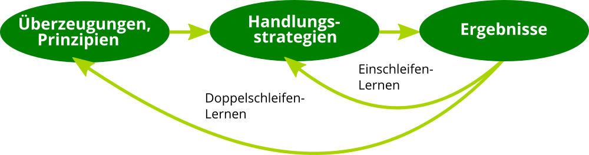

## Die Lernende Organisation und ihre Feinde

Die Veränderung der Organisation ist immer mit Lernen auf individueller und/oder organisationaler Ebene verbunden. Die Idee der Lernenden Organisation geht zurück in die 1990er Jahre und die Gründung des MIT Center for Organizational Learning mit [Peter Senge](https://de.wikipedia.org/wiki/Peter_M._Senge) als als Direktor sowie [Edgar Schein](https://de.wikipedia.org/wiki/Edgar_Schein) und [Chris Argyris](https://de.wikipedia.org/wiki/Chris_Argyris) als Schlüsselpersonen. Ähnlich wie das Konzept des [Wissensmanagements](https://de.wikipedia.org/wiki/Wissensmanagement) betont das organisationale Lernen die Bedeutung von Lernen und Wissen für den Erfolg von Organisationen.

Eine Lernende Organisation unterscheidet sich von einer Nicht-Lernenden Organisation dadurch, dass sie Wissen und Lernen nutzt, um sich mit der notwendigen Veränderungsgeschwindigkeit and die Veränderung in der Umwelt anzupassen ([Survival of the Fittest](https://de.wikipedia.org/wiki/Survival_of_the_Fittest)):

> Eine **Lernende Organisation** ist eine Organisation, die in der Lage ist, Wissen zu schaffen, zu erwerben, zu interpretieren, zu übertragen und zu bewahren und ihr Verhalten gezielt zu ändern, um neues Wissen und neue Einsichten zu reflektieren (David Garvin).

Da Wissen nie final ist, geht es bei der Lernenden Organisation nicht um idealen Zustand mit finalem Wissen. Wie dieser Witz verdeutlicht, geht es vielmehr darum, die sprichwörtliche Nase vorne zu haben:

> Zwei Männer sind zu Fuß in der Wüste unterwegs, als sie plötzlich einem Löwen gegenüberstehen. Der eine Mann reagiert panisch, der andere ist ganz ruhig, greift in seinen Rucksack, holt ein Paar Turnschuhe heraus und beginnt, diese anzuziehen. Sagt der andere Mann zu ihm: “Glaubst Du wirklich, dass Du mit den Turnschuhen schneller laufen kannst, als der Löwe?” Sagt der andere: “Nein, aber schneller, als Du.”.

### Die 2 Schleifen des Lernens

Zu den sehr frühen Modellen des organisationalen Lernens gehört das Zweischleifen-Lernen (Double-Loop-Learning) von Chris Agyris und Donald Schön. Beim Einschleifen-Lernen wird auf eine Differenz zwischen Intention und Ergebnis durch die Wahl einer neuen Handlungsstrategie reagiert. Variablen wie die Normen und Politik der Organisation sowie die Ziele werden als gesetzt hingenommen. Doppelschleifen-Lernen der Organisation liegt dann vor, wenn genau diese Veränderung von Variablen für die Lösung von Problemen oder die Erreichung von Ergebnissen auch mit in Betracht gezogen werden.

### Die 5 Disziplinen der Lernenden Organisation

Wohl der bekannteste Ansatz für Lernende Organisationen sind die fünf Disziplinen von Peter Senge (s.a. [Peter Senge and the learning organization](https://infed.org/mobi/peter-senge-and-the-learning-organization/)) aus dem Buch [Die fünfte Disziplin: Kunst und Praxis der Lernenden Organisation](https://amzn.to/30kwStP). Seine Definition einer Lernenden Organisation:

> Learning organizations are organizations where people continually expand their capacity to create the results they truly desire, where new and expansive patterns of thinking are nurtured, where collective aspiration is set free, and where people are continually learning to see the whole together.

Nach Peter Senge unterscheidet sich eine Lernende Organisation von anderen im Beherrschen von fünf Grund-Disziplinen (Prinzipien und Praktiken):

1. **Systemdenken** - in einer komplexen Welt helfen zu einfache Modelle und Frameworks nicht weiter, sie  beleuchten nur die Teile und nicht das Ganze. Der systemische Blickwinkel ist immer langfristig. Er beobachtet auch Verzögerungs- und Rückkopplungsschleifen, die bei kurzfristigen Betrachtungsweisen oft ignoriert werden. Die Erstellung einer "Landkarte des Systems" (system map) kann helfen, die Kernelemente des Systems und ihre Verbindungen wahrzunehmen.
2. **Persönliche Meisterschaft** - ohne individuelles Lernen kann kein organisationales Lernen stattfinden. Personal mastery ist ein lebenslanger Lernmodus, bei dem man nie "ankommt", sondern sich kontinuierlich weiterentwickelt. Das Ziel ist die Reise des Lernens.
3. **Mentale Modelle** - die verinnerlichten Annahmen und Verallgemeinerungen und Bilder, wie wir die Welt sehen und verstehen. Unsere mentalen Modelle beeinflussen unsere Handlungen und wie wir Wissen aufnehmen sehr stark.
4. **Eine gemeinsame Vision entwickeln** - ein geteiltes Bild von der Zukunft, die man gemeinsam erschaffen möchte ist eine sehr starke Motivation für Experimente und Innovation. Menschen lernen und übertreffen sich, weil sie wollen, nicht weil sie müssen.
5. **Lernen im Team** - das Lernen im Team startet mit dem Dialog und dem "gemeinsamen Denken". Dialog zusammen mit dem Systemdenken fördert eine Sprache, die dem Umgang mit steigender Komplexität angemessen ist.

Senge weist zusätzlich darauf hin, dass eine Lernende Organisation einer neuen Sicht auf Führung bedarf:

> In a learning organization, leaders are designers, stewards and teachers. They are responsible for building organizations were people continually expand their capabilities to understand complexity, clarify vision, and improve shared mental models – that is they are responsible for learning…. Learning organizations will remain a ‘good idea’… until people take a stand for building such organizations. Taking this stand is the first leadership act, the start of inspiring (literally ‘to breathe life into’) the vision of the learning organization.

### Die 3 Bausteine der Lernenden Organisation

Nach der Einschätzung David Garvin und Amy Edmondson (s.a. [Is Your's a Learning Organization?](https://hbr.org/2008/03/is-yours-a-learning-organization)) sind die fünf Disziplinen von Senge nicht konkret genug, um Handlung in Organisationen zu erzeugen ("They overemphasized the forest and paid little attention to the trees"). Aus der Forschung zu Organisation über zwei Jahrzehnte haben sie drei Bausteine (Building Blocks) für die Entwicklung einer Lernenden Organisation identifiziert:

1. **Führung, die das Lernen stärkt** - das Lernen in einer Organisation wir sehr stark vom Verhalten der Führungskräfte beeinflusst. Wenn diese aktiv fragen, zuhören und dabei den Dialog anregen fühlen sich die Menschen ermutigt zu lernen. Wenn sie darüber hinaus signalisieren, dass ihnen die Investition von Zeit in Problemlösung, Wissenstransfer, Querdenken, neue Ideen und Reflexionsprozesse wichtig ist, werden diese Aktivitäten vermehrt stattfinden.
2. **Konkrete Lernprozesse und -praktiken** - Lernprozesse schließen die Generierung, Sammlung, Interpretation und Verteilung von Informationen sowie das Experimentieren und Testen von neuem Wissen mit ein. Das Gelernte und das Wissen müssen systematisch und auf klar definierten Wegen mit Individuen, Teams oder der ganuen Organisation geteilt werden. Der Wissenstransfer kann sich intern an Organisationsmitglieder richten, aber auch nach extern gerichtet sein (Kunden, Experten, Öffentlichkeit). Reflexionen nach Aktivitäten, Prozessen und Projekten sind oft genanntes Beispiel einer konkreten Lernaktivität (z.B. After Action Review, PDCA-Zyklus)
3. **Eine unterstützende Lernumgebung** - eine lernförderliche Umgebung kennzeichnet sich durch die vier Faktoren psychologische Sicherheit, Wertschätzung von Vielfalt, Offenheit gegenüber neuen Ideen und Zeit für Reflexion. Neben den weichen Faktoren der Lernumgebung gehört zu diesem Baustein auch die physische Lernumgebung (Gebäude, Räume, Lernorte etc.) sowie die virtuelle Lernumgebung (Persönliche Lernumgebung, Intranet, Soziales Netzwerk etc.)

Die drei Bausteine sind dabei unabhängig voneinander. Es können je nach Bedarf in einem oder mehren Handlungsfelder Maßnahmen durchgeführt und Fortschritte gemessen werden.

### Die 13 Feinde der Lernenden Organisation

Spricht man über Wissen und Lernen als Erfolgsfaktoren für die Zukunft gibt es meist keine offensichtliche "Feinde", die aktiv dagegen argumentieren. Wichtig ist daher, sich der vielen kleine und großen Barrieren im Alltag der Entwicklung einer Lernenden Organisation bewusst zu sein, sie frühzeitig in der eigenen Praxis zu erkennen und darauf reagieren zu können.

Der [Europäischer Leitfaden zur erfolgreichen Praxis  im Wissensmanagement](https://www.project-consult.de/Files/CWA_KnowledgeManagement.pdf) (2004) enthält eine recht vollständige Übersicht an Barrieren in der Praxis (inkl. Verweisen auf Kapitel, in denen diese beschrieben sind):

1. **Zeit und Prioritäten:** Das Lernen und Verstehen, die Aneignung und Weitergabe von Wissen benötigen Zeit. In zunehmendem Maße sind Erlaubnis und Erwartungen des Management in Bezug auf das Teilen von Wissen Bestandteil der Stellenbeschreibungen (und Mitarbeiterbeurteilungen).
2. **Unterschied zwischen dem Sagen und dem Tun des Managements:** Eine wissensorientierte Kultur wird nur dann bestehen bleiben, wenn entsprechende Unterstützung gegeben wird. Manager, die Programme einführen und sich dann rapide auf Schwerpunkte in anderen Bereichen stürzen werden jegliche Effizienz und Effektivität, die gutes WM mit sich bringt, verlieren. Ein wesentlicher Hinderungsgrund ist die fehlende Rückendeckung durch das Top-Management.
3. **Die anhaltende Ansicht, dass “Wissen Macht ist”:** Interner Wettbewerb fördert in vielen Organisationen das Horten von Wissen; der alleinige Besitz von Wissen wird als Macht und Jobabsicherung betrachtet.
4. **Gleichgültigkeit in Bezug auf Wissensteilung:** Die Werte und Verhaltensweisen des Topmanagements können die Bereitschaft der Mitarbeiter zum Teilen wesentlich beeinflussen.
5. **Not-invented-here-Syndrom:** Menschen erhalten oft größere Befriedigung durch eigene Erfindungen als durch die Übernahme der Ideen anderer, obwohl dies Zeit oder Geld sparen könnte. Für Organisationen stellen solche “Funktionssilos” oft eine Barriere zur Wissensteilung dar.
6. **Belohnungssysteme die Wissensteilung hemmen:** Manche Belohnungs- und Beurteilungssysteme fördern unabsichtlich das Zurückhalten von Wissen. Sogar wenn sie darauf abzielen, Teilen zu fördern, können sie Kulturveränderungen behindern, daher muss die leistungshemmende Seite von Belohnungssystemen beachtet werden.
7. **Verschiedene Kulturen und Subkulturen:** Es gibt erhebliche Unterschiede zwischen sozialen und nationalen Kulturen, die zu unterschiedlichen Interpretationen und Verhaltensweisen führen können. Schlechtes Management kann Vertrauen und Kommunikation negativ beeinflussen.
8. **Wissen verbreitet sich mit der Sprache:** Ohne eine organisationsweit einheitliche Sprache können Wissen und Erfahrungen nicht kommuniziert werden.
9. **Organisation als Maschine betrachten:** Oft wird die Meinung vertreten, dass eine Organisation wie eine Maschine funktioniert, und dass allein das Ändern einzelner Prozesse ausreicht, um Veränderungen zu bewirken. Organisationen bestehen aber aus Menschen, und diese können nicht lernen, wenn man ihre Lernbedingungen nicht berücksichtigt.
10. **Organisationaler “Gedächtnisverlust”:** Organisationen schaffen es oft nicht, erworbenes Wissen und Lektionen aus der Vergangenheit zu bewahren, insbesondere wenn Experten ausscheiden und deren Wissen nicht dokumentiert wurde.
11. **Anstieg der “virtuellen” Arbeit kann hinderlich wie hilfreich sein:** Obwohl kollaborative Software einem WM-Programm enorme Vorteile bringen kann, gibt es viele Anzeichen dafür, dass Menschen immer noch am besten voneinander von Angesicht zu Angesicht lernen können.
12. **Eine Überbewertung von Technologie oder inadäquate technische Hilfsmittel:** Manche Manager meinen, dass alleine das Bereitstellen von Informationen an Mitarbeiter an sich schon ein Wert für die Organisation darstellt. Der Wert eines Kommunikationskanals liegt nicht so sehr darin, welches Wissen damit verfügbar gemacht wird, sondern in der menschlichen Interaktion, die darüber ermöglicht wird.
13. **Wissen wächst nicht ewig:** Das Verlernen und das Ablassen von alten Denkgewohnheiten, ja sogar das Ausscheiden ganzer Wissensbestände, tragen zur Vitalität und Evolution von Wissen bei.

### Die ISO 30401:2018 als Standard für die Lernende Organisation

Der Standard [ISO 30401:2018](https://www.iso.org/standard/68683.html) wurde vom Technische Kommittee 260 "Human Resource Management" der Internationalen Organisation für Normung (ISO) im Jahr 2018 veröffentlicht. Ziel des Standards ist es, ein für die jeweilige Organisation angepasstes Management System zu entwickeln, dass Wertschöpfung durch Wissen und Lernen systematisch fördert.

Im Standard werden 8 Leitprinzipien für dieses Management System beschrieben, die im folgenden kompakt zusammengefasst sind:

1. Wissen ist immateriell, komplex und wird von Menschen geschaffen
2. Wissen ist die wichtigste Quelle der Wertschöpfung für Organisationen, um ihre Ziele zu erreichen
3. Wissensmanagement dient organisationalen Zielen, Strategien und Bedürfnissen.
4. Es gibt keine One-Size-Fits-All-Lösung. Organisationen müssen ihren eigenen Ansatz entwickeln.
5. Menschen schaffen ihr eigenes Wissen durch das persönliche Verständnis von Informationen und Ereignissen. Gemeinsames Verständnis kann durch Interaktion zwischen Menschen im physischen und virtuellen Raum gefördert werden.
6. Wissen kann man nicht direkt managen. Wissensmanagement fokussiert auf die Schaffung förderlicher Rahmenbedingungen (Arbeitsumgebung), die Einfluss auf den Lebenszyklus des Wissens haben.
7. Die Kultur der Organisation ist ein kritischer Faktor für die Effektivität des Wissensmanagements.
8. Wissensmanagement sollte in Iterationen mit Lern- und Feedbackschleifen organisiert sein.

**Hinweis:** Wissen und Lernen werden im Wissensmanagement als zwei Seiten einer Medaille angesehen: Wissen als Objekt (umgangssprachlich meist Wissen genannt) und Wissen als Prozess (Lernen).

Das [KM Cookbook](https://amzn.to/3iz3Lcz) nutzt die Metapher des Restaurants, um anschaulich Fallbeispiele von Lernenden Organisationen darzustellen. Als Rollen werden dabei der Restaurantbesitzer (Sponsor), die Kunden (Organisation), der Koch (KM Leader) und die Beschäftigten des Restaurants (KM Team und externe Unterstützung) unterschieden. Die Fallbeispiele kommen u.a. von General Electric, der Weltbank, Schlumberger, dem Internationalen Olympischen Kommittee und den Ärzten ohne Grenzen.

Als strategisches Tool wird der KM Chef's Canvas beschrieben, der entlang der Kategorien des ISO 30401 Standards strukturiert ist und 57 Leitfragen stellt, mit denen der eigene Ansatz des Wissensmanagements gestaltet werden kann.

**Hinweis:** Mit dem Durchlaufen des Lernpfades in diesem Leitfaden entwickelt man einen Ansatz der Lernenden Organisation, der alle Anforderungen der ISO 30401:2018 erfüllt.

### Der lernOS Canvas für Organisationen

Der lernOS Canvas hilft, das "Systemdenken" über die eigene Organisation zu entwickeln. Mit ihm können die wichtigsten Elemente des "Lernenden Systems" der eigenen Organisation identifiziert, Verbesserungspotentiale benannt und bewertet werden.

Wie auch beim [Business Model Canvas](https://en.wikipedia.org/wiki/Business_Model_Canvas) von Alexander Osterwald dient der lernOS Canvas als Arbeitsinstrument, um am Whiteboard (physisch oder digital) mit einer Gruppe von Personen über die einzelnen Felder des Canvas reden zu können. Sind Systemelemente identifiziert, können diese als Haftnotiz in den Canvas geklebt werden. Man sollte nie auf den Canvas schreiben, da das den Prozess unflexibel macht.

Mit zwei verschiedenen Farben von Haftnotizen kann der Ist-Zustand und das Verbesserungspotential nebeneinander dargestellt werden. Es können z.B. gelbe Haftnotizen für den Ist-Zustand und orange Haftnotizen für mögliche Initiativen zur Verbesserung. Ist die Sammlung der Elemente in allen Bereichen abgeschlossen, können diese mit Punkten bewertet werden, um die wichtigsten Handlungsfelder zu identifizieren.

Der lernOS Canvas für Organisationen besteht aus vier Bereichen. Zentrales Elemente ist der Zweck oder der Organisation, also was die Organisation wirklich, wirklich will. Die vier quadratischen Kästen im linken Teil stellen dar, wer in der Organisation wie handelt (Hierarchie, Prozesse, Netzwerke, Communities) und was für die Ausführung der Handlungen benötigt wird (Menschen, Fähigkeiten, Technik, Infrastruktur).

In den vier Kästen im rechten Teil wird abgebildet, für wen was gemacht wird (Kunden, Zielgruppen, Produkte, Ergebnisse), in welche Richtung die Reise gehen soll (Vision, Strategie, Ziele) und welche kulturellen Rahmenbedingungen zu beachten sind (Kultur, Werte).

Im unteren Bereich des Canvas befindet sich jeweils ein Rechteck für Potentiale (Stärken, Kapital) und Risikofaktoren (Schwächen, Risiken). Mit dem Begriff Kapital ist dabei nicht nur das finanzielle Kapital, sondern auch das [intellektuelle Kapital](https://de.wikipedia.org/wiki/Intellektuelles_Kapital) der Organisation gemeint.

**ProTip:** die Grafik des lernOS Canvas kann für die virtuelle Zusammenarbeit ganz einfach in digitale Whiteboards wie z.B. Microsoft Whiteboard, Mural, Miro oder Conceptboard kopiert werden.
