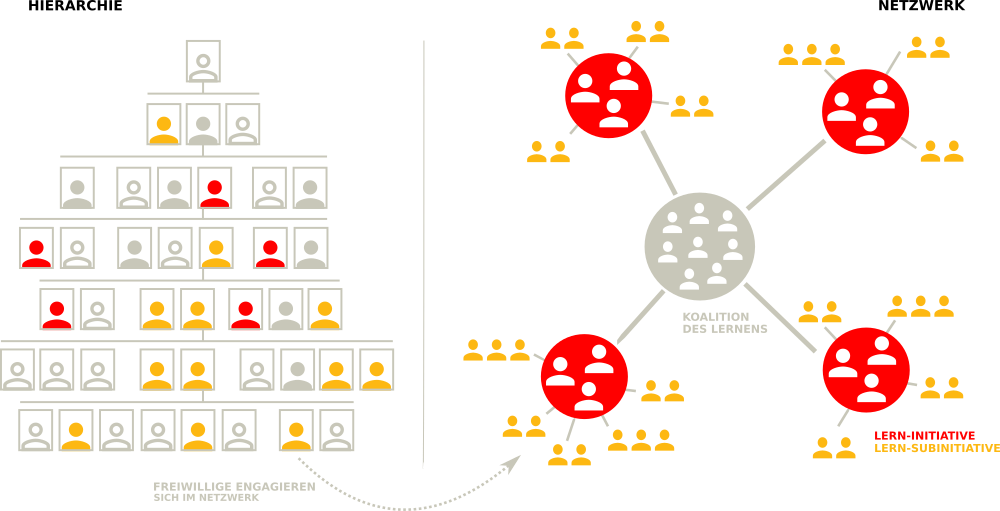

## Eine Lernende Organisation kultivieren

Dieses Kapitel beschreibt alle notwendigen Bestandteile, um mit lernOS für Organisationen gemeinsam eine Lernende Organisation zu kultivieren. Besonders wichtig ist, von Anfang an auf die richtige Sprache zu achten. So kann man Wissensmanagement, Lernende Organisationen oder Lernkulturen nicht "einführen" Das ist ein in der Vergangenheit oft gemachter Fehler, der meist zum Scheitern oder zumindest nicht zum dauerhaften Überleben des Ansatzes geführt hat. Da man eine Organsation wie ausgeführt als soziotechnisches und komplex-adaptives System begreifen muss, wird hier von der "Kultivierung der Lernenden Organisation" gesprochen. Bei dieser Kultivierung wird neben der Einführung von Methoden und Tools auch die Entwicklung von Rahmenbedingungen, Werten und Haltungen (Mindset) geachtet.

Der Ansatz von lernOS für Organisationen besteht sich aus zwei zentralen Bestandteilen:

1. **Koalition des Lernens:** Die "Guiding Coalition" nach Kotter als zentralem Akteur, bestehend aus einer Gruppe von Personen, die das Leitbild der Lernenden Organisation als "Nordstern" in der Organisation etabliert, unterstützende Initiativen identifiziert und vernetzt sowie. Die Koalition des Lernens kann je nach Geschmack und Bedürfnissen der Organisation natürlich auch anders benannt werden.
2. **Open Space des Lernens:** Das bewährte [Open Space Format](https://de.wikipedia.org/wiki/Open_Space) von Harrison Owen hat Daniel Mezick unter dem Namen [Open Space Agility](https://openspaceagility.com/) für die Entwicklung agiler Organisationen adaptiert. In regelmäßigen Abständen von 3-6 Monaten wird die Organisation eingeladen, sich zu einem ausgewählten Motto auszutauschen und zwischen den Open Spaces Lern-Experimente durchzuführen. Der Open Space des Lernens wird von der Koalition des Lernens organisiert. Auch der Open Space kann bei Bedarf anders benannt werden.

Ähnlich dem Konzept des Lebenslangen Lernens (s.a. lernOS für Dich Leitfaden) kann die Entwicklung oder Kultivierung einer Lernenden Organisation nicht als kurzfristiges Projekt oder Programm angegangen werden, sondern erfordert dauerhaftes Engagement der Organisation.

### Koalition des Lernens (KdL)

Die Koalition des Lernens ist eine Gruppe von mindestens drei Personen in der Organisation, denen Wissen und Lernen wirklich, wirklich am Herzen liegen. Anders als frühere Wissensmanagement-Abteilungen oder Bereiche des Chief Learning/Knowledge Office ist die Koalition des Lernens nicht als "Kästchen im Organigramm" verortet, sondern bildet den Kern der Netzwerkstruktur der Organisation (Wie bei Kotter die "Guiding Coalition"). Akteure in der Koalition des Lernens kommen typischerweise aus Personal, Organisationsentwicklung, IT, Strategie, Wissens-/Innovations-/Qualitätsmanagement oder den Fachbereichen.

**Eigenschaften der Koalition des Lernens:**

* Besteht aus Menschen aus allen Bereichen und Ebenen der Organisation, die das Gefühl der Dringlichkeit zutiefst verspüren.
* Die Menschen in der Koalition des Lernens wollen Führung übernehmen, Change Agents sein und anderen helfen, das gleiche zu tun.
* Die Kerngruppe der Koalition des Lernens hat den "Drive", das intellektuelle und emotionale Engagement, das Netzwerk, die Fähigkeiten und die Informationen, um eine effektive "Sonne im Sonnensystem des Netzwerks" zu sein.
* Durch das Erlernen der Zusammenarbeit von Koalition des Lernens und des Führungsgremiums der Organisation sind Hierarchie- und Netzwerk-Seite der Organisation strategisch abgestimmt, erreichen ein hohes Niveau von Verlässlichkeit sowie Effizienz und entwickeln eine ganz neue Fähigkeit für Geschwindigkeit und Agilität.

**Die wichtigsten Aufgaben der Koalition des Lernens:**

* Die Vision der Lernenden Organisation als "Nordstern" und die große Chance, die für die Organisation darin liegt klar herausarbeiten, dokumentieren und kommunizieren.
* Einen Sponsor für die Vision der Lernenden Organisation auf oberster Leitungsebene finden und mit diesem im regelmäßigen Austausch sein
* Initiativen identifizieren und sich mit diesen vernetzen, die an der Kultivierung der Lernenden Organisation mitwirken. Bei Bedarf (und verfügbarer Ressource) neue Initiativen starten.
* Eine "Armee von Freiwilligen" auf- und ausbauen, die die Kultivierung der Lernenden Organisation sowie die Initiativen und Lern-Experimente unterstützt.
* Den Open Space des Lernens organisieren und die Lern-Experimente nachverfolgen.
* Kontinuierlich nach neuen Mitgliedern für die Koalition des Lernens Ausschau halten und diese einbinden.
* Erfolge und Geschichten sichtbar machen, kommunizieren und in den Kontext der Lernenden Organisation stellen (nach innen und nach außen).

### Open Space des Lernens (OSdL)

Das Open Space Format (auch Open Space Technology) für Veranstaltungen wurde um 1985 von Harrison Owen entwickelt. Das Format ermöglicht es Gruppen von 5-2.000 Personen in einem (architektonisch und geistig) offenen Raum komplexe Probleme und Fragestellungen zu bearbeiten. Um einen erfolgreichen Open Space durchzuführen braucht es nur vier Dinge:

1. Ein fesselndes Thema oder Motto
2. Eine interessierte und überzeugte Gruppe von Menschen
3. Ort und Zeit für die Veranstaltung
4. Jemanden, der die Führung übernimmt

Ein Open Space hat ähnlich einem BarCamp keine feste Agenda, aber klare Strukturen und Rahmenbedingungen. Der Rahmen ist notwendig, um innerhalb des vorgegebenen Rahmens Selbstorganisation zu ermöglichen. Meist werden 4-5 Prinzipien und ein Gesetz als Rahmenbedingungen verwendet:

* **Prinzip 1:** Wer auch immer kommt, es sind die richtigen Leute
* **Prinzip 2:** Was auch immer geschieht, es ist das Einzige, was geschehen konnte.
* **Prinzip 3:** Es beginnt, wenn die Zeit reif ist.
* **Prinzip 4:** Vorbei ist vorbei - nicht vorbei ist nicht vorbei.
* **Prinzip 5:** Wo auch immer es geschieht, es ist der richtige Ort.
* **Gesetz:** Die Teilnehmer*innen bleiben nur so lange in einer Gruppe, wie er es für sinnvoll erachtet, also solange er/sie etwas lernt und/oder beitragen kann. Benutze deine beiden Füße, um an einen produktiveren Platz zu gehen.
* **Mache dich darauf gefasst, überrascht zu werden!**

Die Anwendung des Open Space Formats bei Open Space Agility sieht die Wiederholung von Open Spaces im Abstand von 3-6 Monaten vor, um ein verlässliches Raster für Lern-Experimente zu bilden. Für die dauerhafte Begleitung der Open Spaces sind folgende Rollen vorgesehen:

* **Der Sponsor:** authorisiert die Veranstaltung, stellt Wertschätzung der Veranstaltung und ihrer Ergebnisse heraus, übergibt Verantwortung für die Durchführung an den Moderator und lässt dem Open Space seinen Lauf.
* **Der Moderator (facilitator):** erhält die Verantwortung für die Durchführung vom Sponsor, ermöglicht die Selbstorganisation im Open Space und übergibt die Verantwortung für den Erfolg der Veranstaltung an die Teilnehmer.
* **Die Teilnehmer:** entscheiden Session-Besuche und Diskussions-Teilnahmen selbstorganisiert, teilen die Ergebnisse mit dem Rest der Organisation 
* **Die Session-Geber:** schlagen Sessions und Themen für kleine Gruppen vor, ermöglichen allen Session-Teilnehmern Beiträge und sind für die Dokumentation der Session verantwortlich.

Bei Open Space Agility führen Teams in der Organisation zwischen den Open Spaces Experimente mit agilen Methoden unterstützt durch Coaches durch. Beim Open Space des Learnings geht es nicht (nur) um Agilität. Die Leitplanken bildet die Lernende Organisation als Nordstern. Welches Thema oder Motto in einem Open Space behandelt werden soll und welche Initiativen gezielt eingeladen werden sollen, legt die Koaliton des Lernens in Abstimmung mit dem Sponsor fest.

Zentraler Erfolgsfaktor des Open Space Formats ist der einladungsbasierte Ansatz und damit die Freiwilligkeit der Teilnahme: alle Mitglieder der Organisation sind eingeladen, die die kommen, sind genau die richtigen (s.a. Mezick, D.: [Inviting Leadership: Invitation-Based Change in the New World of Work](https://amzn.to/3fQRGgS)). Darüber wird langfristig ein großes Netzwerk von Freiwilligen ("Army of Volunteers") aufgebaut, die aus eigenem Antrieb bei der Kultivierung der Lernenden Organisation mitwirken.

Aus Identitätsgründen sollte sich so ein Netzwerk von Freiwilligen einen geeigneten Namen geben. Oft bestehen bereits aus anderen Projekten, Programmen und Initiativen derartige Netzwerke, die ein guter Ausgangspunkt für den Aufbau sein können. Beispiele für solche Netzwerke aus der Praxis:

* GUIDE Netzwerk bei Continental
* Zusammenarbeit 2.0 Guides bei Audi
* DigitalTogether Champions bei Siemens Healthineers
* Community of Practice Change & Transition (CoPCaT) bei DATEV
* Change Agent Teams (CATs) bei Bayer
* Digital Collaboration Multiplier Network bei Schaeffler
* DieGuides für's #AndersArbeiten bei Deutsche Telekom
* Group Collaboration Guides bei Volkswagen
* Grains bei Siemens
* uvm.

Eine typischer Ablauf eines 1-tägigen Open Space kann z.B. so aussehen (im Gegensatz zu BarCamps mit 45-minütigen Sessions dauert eine Open Space Session in der Regel 90 Minuten):

| Zeit            | Agendapunkt                               |
| --------------- | ----------------------------------------- |
| 09:00-10:30 Uhr | Eröffnung und Erstellung der Agenda       |
| 10:30-12:00 Uhr | Session 1                                 |
| 12:00-13:00 Uhr | Mittagspause                              |
| 13:00-14:30 Uhr | Session 2                                 |
| 14:30-16:00 Uhr | Session 3                                 |
| 16:00-16:30 Uhr | Dokumentation (Erstellung des Protokolls) |
| 16:30-17:00 Uhr | Abschluss                                 |

Der Raum für den Open Space muss genug Platz für alle Teilnehmenden bieten (für Eröffnung, Abschluss und kleine Sessions). Daneben muss es genug Breakout-Räume geben, in die sich die Sessions zurückziehen können (Daumenregel: Teilnehmerzahl/20). In dem Raum muss es eine Wand geben, an die die Agenda und der Sessionplan (auch Space/Time Matrix genannt) mit Haftnotizen und Flipchart-Papier geklebt werden kann. Bei 100 Teilnehmenden kann das z.B. so aussehen:

| Zeit        | Plenum        | Raum 1      | Raum 2      | Raum 3      | Raum 4      | Raum 5      |
| ----------- | ------------- | ----------- | ----------- | ----------- | ----------- | ----------- |
| 09:00-10:30 | Eröffnung     |             |             |             |             |             |
| 10:30-12:00 |               | Session 1.1 | Session 2.1 | Session 3.1 | Session 4.1 | Session 5.1 |
| 12:00-13:00 | Mittagspause  |             |             |             |             |             |
| 13:00-14:30 |               | Session 1.2 | Session 2.2 | Session 3.2 | Session 4.2 | Session 5.2 |
| 14:30-16:00 |               | Session 1.3 | Session 2.3 | Session 3.3 | Session 4.3 | Session 5.3 |
| 16:00-16:30 | Dokumentation |             |             |             |             |             |
| 16:30-17:00 | Abschluss     |             |             |             |             |             |

Im **Open Space Protokoll** (Proceedings) werden alle Ergebnisse und Geschichten des Open Space festgehalten. Dazu gehören mindestens:

* Dokumentation des Themas/Mottos des Open Space
* Kurze Botschaft des Sponsors
* Ergebnisse aller Sessions inkl. Teilnehmenden, geplanter und vorgeschlagener Lern-Aktivitäten und -Initiativen
* Stellungnahme des Sponsors für die Umsetzung der Aktivitäten (insbesondere die, die weitere Autorisierung durch den Sponsor oder anderer Entscheider benötigen)
* Zeit und Ort für den nächsten Open Space

Das Open Space Protokoll wird der ganzen Organisation wenige Stunden nach der Veranstaltung (maximal 24 Stunden) bereitgestellt. Das Dokumentationsmedium sollte dem Kontext und den Teilnehmenden angemessen sein (z.B. Wiki, OneNote, Etherpad). Für die Bereitstellung von Dateien und Bildern bietet sich ein Bereich für unkomplizierten Datei-Upload an.

### Werkzeugkasten des Lernens (WdL)

Nicht jedes Rad muss die Organisation und die Koalition des Lernens neu erfinden. Es gibt viele bewährte Methoden und Tools für den guten Umgang mit Wissen. Diese können im Rahmen eines Sprints erlernt und ausprobiert werden. Für einige dieser Methoden und Tools hält die lernOS Toolbox Leitfäden bereit, die zum leichten Einstieg eingesetzt und bei Bedarf angepasst werden können.

Aktueller Inhalt der **lernOS Toolbox**:

1.  **BarCamp:** Ein BarCamp (auch Unkonferenz) ist eine Konferenz, bei der die Inhalte von den Teilehmern innerhalb eines vorgegebenen Rahmens selber gestaltet werden ([lernOS BarCamp Leitfaden](https://cogneon.github.io/lernos-barcamp/de/)).
2.  **Community of Practice:** Eine Community of Practice (CoP) ist eine Gruppe von Personen mit einem gemeinsamen Interesse, die durch regelmäßige Interaktion voneinander lernen ([lernOS Community Management Leitfaden](https://cogneon.github.io/lernos-cmgmt/de/)).
3.  **Expert Debriefing:** Das Expert Debriefing ist eine Methode zum Wissenstransfer von Experten auf ein oder mehrere Nachfolger (z.B. bei Ruhestand, Abteilungswechsel, Kündigung, Sabattical, Elternzeit, Job Rotation) ([lernOS Expert Debriefing Leitfaden](https://cogneon.github.io/lernos-expert-debriefing/de/)).
8.  **Getting Things Done:** Getting Things Done (GTD) ist eine Selbstmanagement-Methode für Wissensarbeiter (GTD Lernpfad im [lernOS für Dich Leitfaden](https://cogneon.github.io/lernos-for-you/de/)).
11.  **Objectives & Key Results:** Objectives & Key Results (OKR) ist eine einfache und agile Zielmanagement-Methode, die von Individuen, Teams und Organisationen verwendet werden kann  (OKR Lernpfad im [lernOS für Dich Leitfaden](https://cogneon.github.io/lernos-for-you/de/)).
6.  **Podcast:** Ein Podcast besteht aus einer Sammlung von Audio-Dateien, die auf einer Webseite zum automatischen Download zur Verfügung gestellt wird ([lernOS Podcasting Leitfaden](https://cogneon.github.io/lernos-podcasting/de/)).
7.  **Erklärvideo/Screencast:** Ein Screencast ist ein Video, das die Interaktion auf einem Computerbildschirm wahlweise mit oder ohne Ton darstellt (der [lernOS Podcasting Leitfaden](https://cogneon.github.io/lernos-podcasting/de/) soll in Zukunft auch einen Video-Lernpfad erhalten).
8.  **Weblog:** Ein Weblog (auch Blog) ist eine persönliche Webseite im Tagebuch-Format, d.h. die einzelnen Weblog-Einträge werden chronologisch rückwärts angezeigt (Hinweis im [lernOS für Dich Leitfaden](https://cogneon.github.io/lernos-for-you/de/)).
9.  **Wissenslandkarte:** Eine Wissenslandkarte ist eine graphische Darstellung von Wissensgebieten und deren Zusammenhängen (Hinweis im [lernOS für Dich Leitfaden](https://cogneon.github.io/lernos-for-you/de/)).
10.  **Working Out Loud:** Working Out Loud (WOL) ist eine Methode zum strategischen Netzwerken und offenen Teilen von Inhalten (WOL Lernpfad im [lernOS für Dich Leitfaden](https://cogneon.github.io/lernos-for-you/de/) oder [Working Out Loud Guides](https://workingoutloud.com/de/fur-dich)).

Weitere, oft im Rahmen von Lern-Sprints eingesetzte Methoden und Tools sind: Coworking, Design Thinking, Enterprise Social Networks, Fedex/SameDayDelivery Days, Hackathon, Lessons Learned/Retrospektiven, Massive Open Online Courses, Scrum/Agile Methode und Wikis.
